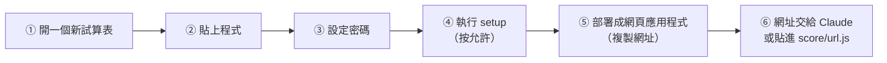

# 成績紀錄：Google 部署說明（一步一步做，大約 15 分鐘）

> 做完這 6 步，學生做〔📝 複習題 5 題〕的成績就會存進**你自己的 Google 試算表**，老師看板也打得開。
> 全部在電腦上做比較好按（用 Chrome，登入你要存成績的那個 Google 帳號）。
> **密碼只打在第 3 步的 Google 網頁裡**，不要貼到 GitHub，也不要寫進任何檔案。

---

## ① 開一個新的 Google 試算表

1. 打開 <https://sheets.google.com>。
2. 按左上角的 **「＋ 空白試算表」**。
3. 按左上角的「未命名的試算表」，改名成 **英文句型成績**（名字隨便取都可以）。

## ② 把程式貼進去

1. 在試算表最上面的選單按 **「擴充功能」➜「Apps Script」**。會開一個新分頁。
2. 新分頁左邊有一個檔案叫 **「程式碼.gs」**（或 Code.gs），右邊是程式。
3. 在右邊程式區按一下，按 **Ctrl＋A**（Mac：⌘＋A）全選，再按 **Delete** 刪掉原本的程式。
4. 打開這個網址，看到整份程式：
   <https://github.com/hsieny627-jpg/AI-Agent-Open-Code/blob/main/score/Code.gs>
   按右上角的 **「複製」圖示（兩個重疊的小方塊，Copy raw file）**。
5. 回到 Apps Script 分頁，在程式區按 **Ctrl＋V**（Mac：⌘＋V）貼上。
6. 按上面的 **💾 儲存**（磁碟片圖示），或按 Ctrl＋S。
7. （可以不做）左上角「未命名的專案」改名成 **成績紀錄**。

## ③ 設定老師看板的密碼（只在這裡打密碼）

1. Apps Script 左邊最下面有一個 **⚙️ 齒輪「專案設定」**，按它。
2. 往下捲到最下面 **「指令碼屬性」**，按 **「新增指令碼屬性」**。
3. **屬性** 那一格打：`TEACHER_PW`（英文大寫，中間是底線）。
4. **值** 那一格打：你的老師看板密碼。
5. 按 **「儲存指令碼屬性」**。
6. 按左邊的 **「< >」編輯器** 回到程式。

## ④ 執行一次 setup（建立工作表＋按允許）

1. 程式區上面有一排按鈕：**▶ 執行** 的右邊有一個下拉選單，選 **`setup`**。
2. 按 **▶ 執行**。
3. 跳出「需要授權」➜ 按 **「審查權限」**。
4. 選你的 Google 帳號。
5. 如果看到「**Google 尚未驗證這個應用程式**」：這是你自己寫的程式，所以 Google 不認識它，是正常的。
   按左下角 **「進階」** ➜ **「前往『成績紀錄』（不安全）」**。
6. 按 **「允許」**。
7. 下面「執行記錄」出現「執行完畢」就好了。
8. 回到試算表分頁看：下面多了三個工作表 **「紀錄」「班級人數」「名單」**。
9. 打開 **「班級人數」**，在每一班旁邊的「人數」那一格填全班人數（例如 304 ➜ 26）。
   只填數字，不要填名字。這是算「👥 參與率」用的，不填也可以用。

## ⑤ 部署成網頁應用程式（拿到網址）

1. 回到 Apps Script 分頁，按右上角藍色的 **「部署」➜「新增部署作業」**。
2. 左邊「選取類型」旁邊有一個 **⚙️ 齒輪**，按它，選 **「網頁應用程式」**。
3. 下面三格這樣填：
   | 欄位 | 選這個 |
   |---|---|
   | 說明 | 成績紀錄（隨便打） |
   | 執行身分 | **我（你的 Gmail）** |
   | 誰可以存取 | **所有人** |

   「所有人」是讓學生的平板**不用登入 Google** 也能送成績。只有你的程式能讀寫你的試算表；看板要密碼。
4. 按 **「部署」**。（如果又跳出授權，照第 ④ 步的 3～6 再按一次允許。）
5. 出現 **「網頁應用程式」網址**（`https://script.google.com/macros/s/……/exec`），按旁邊的 **「複製」**。
6. 按 **「完成」**。

## ⑥ 把網址接到網站上（兩種做法，選一種）

**做法 A（最簡單）：把網址貼給 Claude**
開新對話，貼：「照 score/Google部署說明.md 第 ⑥ 步，把這個網址放進 score/url.js 並推到 main：（貼網址）」。

**做法 B：自己在 GitHub 改**
1. 打開 <https://github.com/hsieny627-jpg/AI-Agent-Open-Code/blob/main/score/url.js>。
2. 按右上角的 **✏️ 鉛筆（Edit this file）**。
3. 找到這一行：`window.SCORE_URL = '';`
   把網址貼在**兩個單引號中間**，變成：`window.SCORE_URL = 'https://script.google.com/macros/s/……/exec';`
4. 按右上角綠色的 **「Commit changes…」** ➜ 再按一次 **「Commit changes」**。
5. 等 1～2 分鐘，網站就會更新。

---

## ✅ 做完以後檢查一次（2 分鐘）

1. 用平板打開三年級或四年級的 Unit 1 句型頁，按〔📝 複習題 5 題〕。
   看到 **「🔢 輸入你的號碼」** 和數字鍵盤 ＝ 成功接上了。
2. 打一個測試號碼（例如 30401），做完 5 題。
3. 回到試算表的 **「紀錄」**，多了一列 ＝ 成績有存進來。
4. 打開老師看板：<https://hsieny627-jpg.github.io/AI-Agent-Open-Code/teacher/>，打你的密碼 ➜ 看得到剛剛那一筆。
5. 測試那一筆不要算：在老師看板點那個人 ➜ 按 **🚫 作廢**（或在試算表「紀錄」最後一欄「作廢」打 `TRUE`）。

## 平常怎麼用

| 想做什麼 | 怎麼做 |
|---|---|
| 看成績、下載 | 老師看板（上面第 4 點的網址，自己存書籤；首頁沒有連結）➜〔⬇ 一鍵下載 Excel〕 |
| 暫時不讓學生看排行榜（例如月考前） | 老師看板右上角〔🏆 學生排行榜：開〕按一下變「關」 |
| 有人冒用別人的號碼 | 老師看板 ➜ 👤 個人 ➜ 點那個人 ➜ 那一次〔🚫 作廢〕（看得到是哪一台平板做的） |
| 換密碼 | Apps Script ➜ ⚙️ 專案設定 ➜ 指令碼屬性 ➜ 改 `TEACHER_PW` 的值 ➜ 儲存（不用重新部署） |
| 以後要加名單（學生打 5 碼後跳出「你是 304 班 5 號 ○○○ 嗎？」） | 試算表「名單」填 班級｜座號｜姓名；指令碼屬性加 `ROSTER` ＝ `on`。名單只在你的試算表，不在 GitHub |

## 程式更新以後（Claude 改了 score/Code.gs 才要做）

1. 照第 ② 步，把新的 Code.gs 整份貼上、儲存。
2. **「部署」➜「管理部署作業」** ➜ 按右邊 **✏️ 鉛筆** ➜「版本」選 **「新版本」** ➜ 按 **「部署」**。
3. 網址**不會變**，第 ⑥ 步不用再做。

## 要知道的事

- 網站是公開的，Apps Script 網址也在 GitHub 上：有人如果故意亂送，最多只能多出「看起來像學生作答」的紀錄（伺服器會檢查班級、座號、題組）；
  **讀成績、作廢、關排行榜都要密碼**。看到奇怪的紀錄就作廢它。
- Google 免費帳號的限制（每天可以執行很多次，一個學校用不完）：一筆成績大約 1～2 秒存好。
- 沒有網路的時候，成績先存在平板裡，連上網會自動補送（同一筆不會存兩次）。
