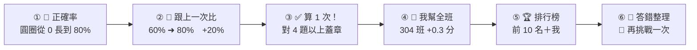

# 2026-10-07 對話 C 第 ① 步：設計＋研究證據＋要你決定的問題（還沒寫程式）

> 流程：**① 這份清單（現在）** ➜ ② 你回覆（＋給老師看板密碼，只在對話裡給，不寫進 repo）➜ ③ 實作、量測 0 失敗、推 main ➜ ④ Google 部署說明。
> 需求原文和已經決定的事在 `2026-10-06_C_在家複習與成績紀錄_需求.md`（這份不重複，只寫新的）。
> **回覆方法**：最後面第六節是「要你決定的題目」，每題都有「建議」。你只要寫「全部照建議」，或「Q3 選 B、Q8 選 A…」就好。

---

## 一、研究證據（每一條我都打開核對過：網址都能連上，摘要內容逐條讀過）

| # | 研究 | 一句話結論 | 用在哪裡 | 網址 |
|---|---|---|---|---|
| R1 | Roediger & Karpicke 2006（實驗） | 反覆**做題**比反覆讀，一週後記得多 | 在家複習要「做題」，不只是看卡 | https://doi.org/10.1111/j.1467-9280.2006.01693.x |
| R2 | Adesope 等 2017（統合分析） | 練習測驗比重讀和其他所有方法都更有效 | 同上；作答次數榜鼓勵多練 | https://doi.org/10.3102/0034654316689306 |
| R3 | Dunlosky 等 2013（10 種讀書方法評比） | 最有效的兩種：**練習測驗**、**分散練習**（分好幾天做） | 次數榜要鼓勵「分好幾天做」，不是一天灌 | https://doi.org/10.1177/1529100612453266 |
| R4 | Cepeda 等 2006（統合分析，317 個實驗） | 分散練習比一次做完記得久；間隔愈長，記得愈久 | 同上（Q11 建議：同一組一天最多算 3 次） | https://doi.org/10.1037/0033-2909.132.3.354 |
| R5 | Hattie & Timperley 2007（回顧） | 回饋影響很大，但可正可負，要看種類 | 結算頁先講「題目怎麼改」 | https://doi.org/10.3102/003465430298487 |
| R6 | Wisniewski、Zierer、Hattie 2020（統合分析 435 篇） | 回饋平均有中度效果（d＝0.48），**資訊愈多（告訴你哪裡錯、怎麼改）效果愈大** | 答錯整理、老師錯題分析 | https://doi.org/10.3389/fpsyg.2019.03087 |
| R7 | Kluger & DeNisi 1996（統合分析） | 超過 1/3 的回饋讓表現變差；回饋愈指向「我這個人」（我排第幾），效果愈差 | 名次不當主角 | https://doi.org/10.1037/0033-2909.119.2.254 |
| R8 | Butler 1988（小學五、六年級） | 只給分數（跟別人比）不如給評語（怎麼改進） | 同上 | https://doi.org/10.1111/j.2044-8279.1988.tb00874.x |
| R9 | Murphy & Weinhardt 2020（英國全體學生） | 同樣能力，小學班上排名低的人，後來成績和自信都比較低 | 名次數字只給老師（已決定） | https://doi.org/10.1093/restud/rdaa020 |
| R10 | Bursztyn & Jensen 2015（美國高中） | 加了公開排行榜，整體表現掉 24%，原本前段的學生掉 40%（怕被同學看到） | 老師要有「關掉學生排行榜」的開關（Q14） | https://doi.org/10.1093/qje/qjv021 |
| R11 | Hanus & Fox 2015（大學一學期） | 有排行榜＋徽章的班，內在動機、滿意度、期末考都比較低 | 同上 | https://doi.org/10.1016/j.compedu.2014.08.019 |
| R12 | **Azmat & Iriberri 2009（西班牙高中，自然實驗）——反方證據** | 告訴學生「你在班平均之上或之下、差多少」，成績**提高 5%**，前中後段都有效；拿掉就消失 | 排行榜**不是一定有害**；「跟目標差多少」的資訊有用 ➜「再多 N 分進前 10」 | https://econ-papers.upf.edu/en/onepaper.php?id=1148 |
| R13 | Landers 等 2017（實驗） | 有排行榜時，人會自動把目標定在「排行榜頂端」，效果跟「困難目標」一樣 | 排行榜有用，但要讓每個人都有一個「搆得到的榜」 | https://doi.org/10.1016/j.chb.2015.08.008 |
| R14 | Sailer & Homner 2020（遊戲化統合分析） | 遊戲化對學習有小到中的效果；**「競爭＋合作」一起用**效果最好 | 班際榜 ＝ 全班合作一起拚（「你這一次幫 304 班 ＋0.3 分」） | https://doi.org/10.1007/s10648-019-09498-w |
| R15 | Bai、Hew、Huang 2020（遊戲化統合分析） | 遊戲化整體有中度效果（g＝0.50） | 整體可以做 | https://doi.org/10.1016/j.edurev.2020.100322 |
| R16 | Ginns & Martin 2018（小學五、六年級） | 叫學生「打敗自己上一次」（個人最佳 PB），表現小幅但可靠地進步 | 結算頁主角 ＝ 自己的進步和新紀錄（已決定） | https://doi.org/10.1007/s13384-018-0268-9 |
| R17 | Wang & Tahir 2020（Kahoot 研究回顧 93 篇） | Kahoot 整體有幫助；學生抱怨：**限時太緊有壓力、時間不夠思考**、投影字太小看不清 | 速度分不要佔太重（Q9）；字要大 | https://doi.org/10.1016/j.compedu.2020.103818 |
| R18 | Wise & Kong 2005（電腦測驗） | 答得「太快」（還沒讀完題就按）＝ 沒在認真作答，可以用作答時間抓出來 | 1 秒內就按的答案，老師看板標「⚡ 秒按」（Q10） | https://doi.org/10.1207/s15324818ame1802_2 |
| R19 | Metcalfe 2017（回顧） | 犯錯＋馬上給正確回饋，學得更好；**很有把握卻答錯的，最容易被訂正**；低風險時多犯錯是好事 | 錯題排行＋全班訂正模式；結算頁說「答錯是在學習」 | https://doi.org/10.1146/annurev-psych-010416-044022 |
| R20 | Black & Wiliam 1998（形成性評量回顧） | 經常給學生回饋、老師依資料調整教學，學習進步很大 | 老師看板：錯題分析、「這週還沒做的人」 | https://doi.org/10.1080/0969595980050102 |
| R21 | Kulik 等 1990（精熟學習統合分析 108 篇） | 「達到門檻才算過關」的精熟學習有效，**對班上較弱的學生效果更大** | 支持「答對 2/3 以上（5 題對 4 題）才算 1 次」 | https://doi.org/10.3102/00346543060002265 |

> 查不到研究、只是實務建議的地方，下面一律標「（實務，沒有研究）」。

---

## 二、整體架構（秒懂圖）


- 網站（GitHub，公開）**只放程式**；成績、密碼只在你的 Google 試算表和 Apps Script 裡。
- 沒網路時：成績先存在平板，連上網自動補送（不會不見）。

---

## 三、學生畫面設計

### 3-1 登入（5 碼）

```
┌──────────────────────────────────┐
│   🔢 輸入你的號碼                 │
│   ┌──┬──┬──┐┌──┬──┐               │
│   │ 3│ 0│ 5││ 0│ 9│   ← 一格一個數字│
│   └──┴──┴──┘└──┴──┘               │
│     🏫 305 班     🪑 9 號          │ ← 打一個字，下面就長出來
│   ┌───┬───┬───┐                  │
│   │ 1 │ 2 │ 3 │  大數字鍵盤        │
│   │ 4 │ 5 │ 6 │  （每顆 ≧ 64px）   │
│   │ 7 │ 8 │ 9 │                   │
│   │ ⌫ │ 0 │ ✅│                   │
│   └───┴───┴───┘                  │
└──────────────────────────────────┘
```
- 動畫：一開始示範「3 0 5 0 9」自己一格一格跳進去，前 3 格變藍飛到「🏫 305 班」、後 2 格變綠飛到「🪑 9 號」，再清空讓學生自己打。
- 打錯班（不是 304、307、311、402、406、409、410）：格子左右搖一下＋「🏫 沒有這一班，再看一次」。座號不是 01～40 同樣。
- 平板記住登入；每次開頁右上角顯示「🪑 30509」，點一下可以換人（Q5）。

### 3-2 作答中（B 已做的畫面＋改兩個地方）

```
┌──────────────────────────────────┐
│ 🪑30509          🏆 3,820 分      │ ← 右上角金色大數字（已做）
│                  🏅 本班第 3 名    │ ← 只有前 10 名顯示名次
│        ⏱ ( 11 )  ⚡ +700           │   不在前 10：⬆ 再 640 分進前 10
│   Who’s he?                        │
│   [ A ] [ B ] [ C ] [ D ]          │
└──────────────────────────────────┘
```
- 名次從「這台平板」改成「**本班做過這一組的人**」（B 留下的待辦）。

### 3-3 作答結束（一幕一幕出來，每幕 1～2 秒，按「下一步」也可以跳過）



| 幕 | 畫面（文字＋簡圖） | 動畫 | 為什麼（研究） |
|---|---|---|---|
| ① 正確率 | 大圓圈「🎯 4／5 ＝ 80%」＋旁邊小字「⚡ 總分 62」 | 圓圈從 0 轉到 80%，數字一起跳 | 正確率當主角，速度是配角（R17、R7） |
| ② 我進步了 | `上次 ▓▓▓░░ 60%` ➜ `這次 ▓▓▓▓░ 80%`　**🚀 ＋20%**；破紀錄 ＝「🏅 新紀錄！」金色爆開；第一次做 ＝「⭐ 第一次紀錄：80%，下次打敗它！」；退步 ＝「💪 上次 100%，這次 80%，再挑戰一次！」（不寫 −20） | 兩條長條長出來、箭頭飛上去 | PB 打敗自己（R16） |
| ③ 算不算 1 次 | 對 4 題以上：「✅ 算 1 次！　🔁 這週 7 次」大印章蓋下去；對 3 題以下：「再多對 1 題就算 1 次 💪」 | 印章蓋下＋次數 +1 | 精熟門檻（R21）；多練有效（R1、R2） |
| ④ 我幫全班 | 「🏫 304 班 平均 82 ➜ 82.3（你幫全班 ＋0.3）」＋各班一條長條，自己班發亮 | 長條往右長，自己班那條動一下 | 競爭＋合作（R14）；**不顯示誰拉低全班** |
| ⑤ 排行榜 | 四顆大分頁：🎯 正確率｜⚡ 總分｜🔁 次數｜🚀 進步；上面切換〔本班〕〔全年級〕。前 3 名頒獎台，4～10 名一排；自己在前 10 ＝ 那一排發亮；不在 ＝ 最下面一行「🪑 你：⬆ 再 6% 進前 10」（**不顯示名次數字**，已決定） | 頒獎台由下往上升起 | 「跟目標差多少」有用（R12、R13）；名次數字只給老師（R9） |
| ⑥ 答錯整理 | 已做的「📌 答錯整理」＋「答錯是大腦在學習 🧠」＋〔🔁 再挑戰一次〕〔➡ 下一個分頁〕 | — | 錯誤＋馬上訂正（R19） |

---

## 四、老師看板設計（一頁，iPad 和教室觸控螢幕都能用）

```
┌──────────────────────────────────────────────────────┐
│ 👩‍🏫 老師看板   [三年級▼] [全部班▼] [本週▼]   [⬇ 一鍵下載 Excel] │
├──────────┬──────────┬──────────┬──────────┤
│🎯 正確率  │⚡ 總分     │🔁 作答次數 │👥 有做的人  │ ← 四個大數字
│  86 分    │  58 分    │  412 次   │  71／80 人 │
├──────────┴──────────┴──────────┴──────────┤
│ [👤 個人] [🏆 排行榜] [🏫 班際] [❌ 錯題] [🔔 要關心] │ ← 五個分頁
└──────────────────────────────────────────────────────┘
```

| 分頁 | 內容 | 秒懂圖表 |
|---|---|---|
| 👤 個人 | 每人一列：5 碼｜🎯 正確率｜⚡ 總分｜🔁 次數｜🚀 進步｜班內名次（四種）｜全年級名次（四種）｜最後一次作答時間。點欄位標題排序。點一個人 ➜ 他每一組的每一次（折線圖：正確率隨次數變化） | 表格＋每格小長條 |
| 🏆 排行榜 | 四種榜 ✕〔本班／全年級〕，**全部學生**（老師才看得到名次數字） | 長條圖排行 |
| 🏫 班際 | 同年級各班：🎯 平均正確率、⚡ 平均總分、🔁 總次數、👥 參與率、🚀 平均進步；五張長條圖 | 長條圖（同年級才比，Q4） |
| ❌ 錯題 | 最常錯的 10 題（可切本班／全年級）：答錯率長條。點一題 ➜ 題目放大＋四個選項各有幾 % 的人選（最多人選的錯誤選項紅色標出「最常見的誤會」＋那一題原本的 💡 為什麼）。按〔📺 全班訂正〕＝ 全螢幕投影這一題：先讓全班猜 ➜ 點一下亮出各選項 % ➜ 再點亮出正解並唸 3 次 | 長條圖＋選項分布 |
| 🔔 要關心 | 這週還沒做的人；平均正確率 < 60% 的人；「⚡ 秒按」很多的人（1 秒內就按，R18）| 名單（只有老師看） |

- **⬇ 一鍵下載 Excel**：一個 .xlsx，五張工作表（個人、排行榜、班際、錯題、原始紀錄），按一下就下載（Q16）。
- 進入看板要密碼（密碼存在 Apps Script，網頁裡沒有）。

### 分數怎麼算（兩種百分制，照你的需求）

| 名稱 | 一組怎麼算 | 例子 |
|---|---|---|
| 🎯 正確率（百分制） | 答對題數 ÷ 題數 ✕ 100 | 對 4 題 ＝ 80 分 |
| ⚡ 總分（百分制） | 這組得分 ÷ 滿分 5000 ✕ 100（每題 100 ＋ 速度分最多 900，B 已做） | 3100 分 ＝ 62 分 |
| 個人 ／ 班級 ／ 年級平均 | 先算每個人（Q7），再平均到班、到年級 | — |

---

## 五、根據研究的建議（真正幫助學習的才放）

| # | 建議 | 證據 |
|---|---|---|
| S1 | 結算頁主角 ＝ 正確率＋跟自己上一次比（PB）；排行榜放後面（**已決定，照做**） | R7、R8、R16 |
| S2 | 每個人都有一個「搆得到的榜」：正確率、總分（能力）、次數（努力）、進步（後段最容易上）（**已決定**） | R12、R13 |
| S3 | 班際榜 ＝ 全班合作：顯示「你這次幫全班 ＋0.3 分」；**永遠不顯示是誰拉低全班平均** | R14 |
| S4 | 錯題排行＋〔📺 全班訂正〕：先猜、再看大家選什麼、再公布正解 | R6、R19、R20 |
| S5 | 次數榜鼓勵「分好幾天做」：同一組**一天最多算 3 次**（Q11） | R3、R4 |
| S6 | 結算頁一顆大大的〔🔁 再挑戰一次〕：馬上再做一次同一組 | R1、R19 |
| S7 | 「⚡ 秒按」偵測：1 秒內就按的答案，老師看板看得到（不扣學生分、不告訴學生）（Q10） | R18 |
| S8 | 老師有一個「學生排行榜 開／關」開關（例如月考前先關掉） | R10、R11 |
| S9 | 排行榜分「本週」和「這學期」，每週一歸零重新開始，後段的人每週都有新機會（實務，沒有研究）（Q12） | — |

---

## 六、要你決定的題目（每題都有建議；可以只回「全部照建議」）

### A. 研究顯示可能傷害學習的地方（講理由＋證據＋替代方案）

**Q1 ⚡ 總分（百分制）幾乎都在比速度**
- 現在每題 100 分是「答對」、900 分是「速度」。全部答對但每題用了 10 秒（15 秒題）的學生：每題 100＋300＝400 ➜ 總分只有 **40 分**；全部亂猜很快按、猜對 2 題：可能也有 36 分。也就是「總分」主要量的是手快不快，不是會不會。
- 證據：限時壓力是 Kahoot 學生最常抱怨的事（R17）；按太快 ＝ 沒認真作答（R18）。
- 選項：
  - **A（建議）**：作答中的分數照舊（好玩、刺激）；但排行榜和看板的「⚡ 總分（百分制）」改成 **答對 60 分 ＋ 速度 40 分**（全對但很慢 ＝ 60＋少少；全對又快 ＝ 100）。
  - B：照原本（100＋900）換算百分制。
  - C：拿掉總分榜，只留正確率榜。

**Q2 「再多 N 分進前 10」差太多時反而洩氣**
- 例如差 45%，後段學生看到會覺得不可能（實務，沒有研究；R12 的研究是「告訴你跟平均差多少」，有幫助）。
- **A（建議）**：差距小（正確率 20% 以內、次數 5 次以內）才顯示「⬆ 再 N 進前 10」；差太多就顯示「🚀 你這次比上次 ＋N%」或「⭐ 打敗你自己的紀錄 N%」。
- B：一律顯示差距。

**Q3 「進步百分比」的三個小陷阱**（你已決定：最近一次 − 上一次，同一組題目）
1. 5 題的正確率只有 0、20、40、60、80、100 六種，進步只會是 ±20、±40…，很多人同分。
2. 上次 100% 的人永遠不會進步 ➜ 好學生上不了進步榜。
3. 故意第一次亂做、第二次認真，就能「進步 +80%」。
- **A（建議）**：
  - 每一組：最近一次 − 上一次（照你的決定，**所有作答都算**，不只算「算 1 次」的）。
  - 個人進步 ＝ **這週**做過兩次以上的那幾組，平均起來。
  - 上一次已經 100%、這次也 100%：不算進步，但結算頁顯示「🔥 保持 100%」，進步榜旁邊另外一個「🔥 保持滿分」名單。
  - 防亂做：上一次如果「⚡ 秒按」超過一半，那一次不拿來比（R18）。
- B：完全照原本，不加任何規則。
- ⚠️ 需求檔標的：「同一組題目」＝ 同一個分頁、同一級的那 5 題，**對嗎？**（建議：對）

**Q4 公開排行榜（已決定：學生只看前 10 名、看不到自己名次）**
- 還有一個風險：前段學生怕上榜被注意（R10）、整體動機下降（R11）。反方證據：告訴學生相對位置可以提高成績（R12）。
- **A（建議）**：照你的決定做，再加 S8「老師可以一鍵關掉學生看到的排行榜」（關掉時結算頁只剩 ①～④ 和 ⑥）。
- B：不要開關。

### B. 看不懂、要你決定的

**Q5 哪些地方要記成績？**
- **A（建議）**：教學網站（三年級、四年級）每一個分頁的〔📝 複習題 5 題〕＋在家複習網站的〔📝 複習題 5 題〕都記；看板標出「🏫 在校／🏠 在家」。暖身題、複習遊戲、Review 1 **不記**。
- B：只記在家複習。 C：也記暖身題和遊戲。

**Q6 一定要登入才能做題嗎？**
- **A（建議）**：教學網站上課用 ＝ 一定要登入（平板記住，只登一次）；在家複習 ＝ 可以按〔👀 先練習，不記成績〕。
- B：兩邊都一定要登入。

**Q7 有人冒用別人的 5 碼怎麼辦？**（只有 5 碼、沒有密碼，同學知道別人座號就能打）
- **A（建議）**：照你的決定只用 5 碼；每台平板第一次登入會被記住（看板看得到「這一筆是哪台平板」），老師在試算表把那一列「作廢」打勾就不算。
- B：每個學生多一個 2 碼的「幸運數字」（第一次自己設定），之後要 5 碼＋幸運數字。

**Q8 「個人總成績」用哪幾次算？**
- **A（建議）**：每一組取「**最近一次**」，再把做過的組平均（反映現在會不會；早期答錯不會一直拖累）。
- B：所有作答全部平均。 C：每一組取最好的一次。

**Q9 班際比較的範圍**
- **A（建議）**：只跟同年級比（三年級 304／307／311 一起比；四年級 402／406／409／410 一起比），因為題目不一樣。

**Q10 「⚡ 秒按」標準**
- **A（建議）**：開始作答 1 秒內就按（認讀題要先聽四句，從四句唸完才開始算）。只在老師看板顯示，不影響學生分數。
- B：不要這個功能。

**Q11 作答總次數：同一組一天最多算幾次？**（已決定：答對 2/3 以上才算 1 次）
- **A（建議）**：同一組一天最多算 **3 次**（鼓勵分好幾天練，R3、R4）。
- B：不限。

**Q12 排行榜多久歸零？**
- **A（建議）**：學生看的預設是「本週」（週一 00:00 歸零），可以切「這學期」；老師看板兩種都有，還可以自選日期。
- B：只有這學期累計。

**Q13 平均的分母（班平均怎麼算）**
- 只算「有做的人」的話，沒做的人不會拉低平均，但看不出參與率。
- **A（建議）**：班平均 ＝ 有做的人的平均；另外顯示「👥 參與率 71／80」。需要你在試算表填每班人數（只填數字，不填名字）。
- B：不顯示參與率（不用填人數）。

**Q14 同分怎麼排？**（很多人正確率 100%，前 10 名可能超過 10 人）
- **A（建議）**：正確率同分 ➜ 比總分；總分也同 ➜ 同名次（並列，可能超過 10 人上榜）。次數、進步同分 ➜ 同名次。

**Q15 在家複習要加哪些基礎句型？**（已決定：「每一個有『基礎』的分頁」）
- 現在在家複習每個 Unit 有 4 個分頁：1、2（都是進階）、3 中英語序、4 縮寫動畫。
- **A（建議）**：分頁 1、2 改成跟教學網站一樣有〔基礎｜進階〕兩級（各自有 📝 複習題 5 題），其他分頁不變。
- B：A ＋ 再加教學網站的「一問一答」分頁（四年級 Unit 2 再加「1-2 Is he/she a ___?」）。
- ⚠️ 2026-10-07 新做的「⚡ 縮寫動畫」「⚖️ 比較」兩個主題，在家複習要不要也放？（建議：這次不放，只做你指定的）

**Q16 一鍵下載的格式**
- **A（建議）**：Excel（.xlsx）一個檔、五張工作表。 B：CSV（每一張一個檔）。

**Q17 年級網站互相擋**
- **A（建議）**：三年級的網站只能輸入 304、307、311 開頭；四年級只能輸入 402、406、409、410（打錯年級會提示「這是三年級的網站」）。

**Q18 老師看板放哪裡？**
- **A（建議）**：網站裡一個頁面（例如 `teacher/`，首頁不放連結，你自己存書籤），打開要輸入密碼。
- B：只用 Google 試算表本身（不做看板頁；圖表做在試算表裡）。

---

## 七、你回覆以後我會做的（③）

1. Google Apps Script 程式（存成績、算排行、密碼放「指令碼屬性」）＋網站的登入、結算頁、老師看板。
2. 在家複習加基礎句型（Q15）。
3. build、量測（兩個網站＋在家複習＋老師看板，iPad 直式／橫式、教室觸控螢幕尺寸），只印失敗項，0 失敗才推 main。
4. 寫 `C_Google部署說明.md`：一步一步（每一步按哪裡），包含建立試算表、貼程式、設定密碼、部署、把網址貼回來。
