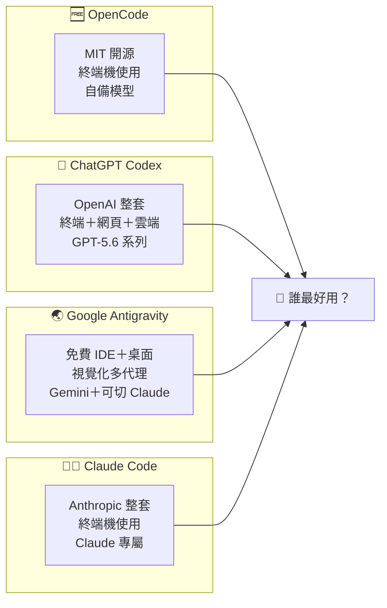
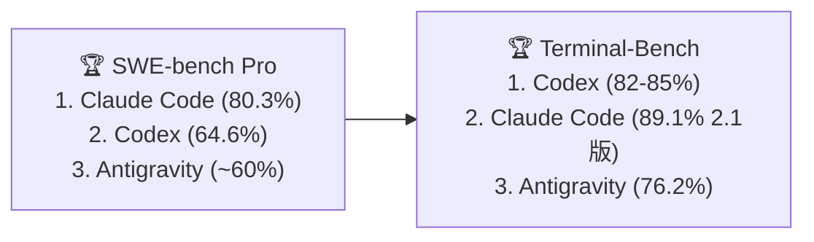

# 四方秒懂圖表：OpenCode vs ChatGPT Codex vs Google Antigravity vs Claude Code

> 適用對象：**任何 AI Agent**（Claude Code／Codex／Antigravity／OpenCode），人類讀者亦可直接閱讀。
> 用途：使用者想比較「四個 AI Agent 付費方案，誰執行任務最快最好、誰 CP 值最高」時，Agent 讀本檔帶使用者秒懂。
> 查證日期：2026-08-06。**所有數字皆附來源網址，可複查；基準成績每月會變動，以官方排行榜最新版為準。**

---

## 一句話看懂

> **四個 Agent 都是「幫你動手的 AI 助手」，差別在：誰免費、誰最強、誰便宜、誰適合不懂程式的你。**
>
> **成效最強：Claude Code 與 Codex 並列頂尖（實測第一、第二名）。**
> **CP 值最高：你已經付錢的那個生態圈（有 ChatGPT 就 Codex、有 Google 就 Antigravity 免費版、什麼都不買就 OpenCode）。**
> **最適合你（老師）：Antigravity 免費版入門、Codex／Claude Code 出重活，OpenCode 留著跑現有工作流。**

---

## 🗺️ 四個 Agent 定位一張圖

**重點差別**：OpenCode 是「空殼」，成效看你接哪個模型（可免費、可最強）；其他三個是「整套」，成效固定。

---

## 💰 付費方案速覽表（官方定價）

| 方案 | **OpenCode** | **Codex** | **Antigravity** | **Claude Code** |
|------|------|------|------|------|
| 免費 | ✅ **$0 全功能**（MIT 開源） | ⚠️ Free 極少量 | ✅ **$0 預覽版**（配額嚴） | ❌ 免費版**不能**用終端 | 
| 中階 | **$5首月→$10/月**（Go 方案） | **Plus $20/月** | **Pro $20/月**（Google AI Pro） | **Pro $20/月** |
| 高階 | Zen 預付按用量 | Pro $100／$200（5x／20x） | Ultra $100／$200（5x／20x） | Max 5x $100／Max 20x $200 |
| 超量計費 | 用自己的 API key | 2026/4 起 token 計費 | 買點數（$25=2,500點） | API 按 token（Opus $5/$25 每百萬） |
| 用量參考 | 依模型額度 | 活躍開發者實測 $100–200/月 | 免費每天約 20 個代理請求 | Pro 約 44K tokens／5小時 |
| 出處 | opencode.ai/docs/go | chatgpt.com/pricing | antigravity.google/pricing | claude.com/pricing |

> 💡 **四個都從 $20 起跳，重點是「$20 買到多少」**：
> - Codex / Claude Code：$20 = 頂尖成效，但用量有限（Codex 對已訂 ChatGPT 者是**邊際 $0**）。
> - Antigravity Pro $20 = 綁 Google AI Pro，Gemini 3.5 Pro + Claude 可切，視覺化對新手最友善。
> - OpenCode $10 = 最便宜的真訂閱，但成效看你選哪個模型。

---

## 🧪 科學實證：誰「執行任務」最快最好？（最重要一欄）

### 三個官方排行榜（非廠商自嗨）

| 排行榜 | **Codex (GPT-5.6)** | **Claude Code** | **Antigravity (預設 Gemini)** | **OpenCode (依所接模型)** |
|--------|------|------|------|------|
| **SWE-bench Verified**（真實 bug 修復） | GPT-5.6 Sol **96.2%** | Fable 5 **95%**（8月暫停評測） | Gemini 3.1 Pro **80.6%** | 接頂級模型可達頂尖 |
| **SWE-bench Pro**（更難、防背題） | GPT-5.6 Sol **64.6%** | **Opus 5 79.2%／Mythos 5 80.3% 居冠** | ~59.8% | 同左 |
| **Terminal-Bench**（終端任務） | **Codex CLI 居冠 82–85%** | Opus 5 **89.1%**（2.1版） | Gemini 3.5 Flash 76.2% | OpenCode+Opus 4.5 僅 51.7%（第64名） |
| 速度（吞吐） | token 最省（約 1/3~1/4） | 中 | **最快 289 tok/s** | 依模型 |
| 出處 | swebench.com、tbench.ai、labs.scale.com/leaderboard/swe_bench_pro_public、codingfleet.com/blog | 同左 | 同左 | tbench.ai/leaderboard/terminal-bench/2.0 |

### 排行榜畫面示意

### 三大關鍵結論（多來源一致，鐵證級）

1. **「任務完成品質」前兩名是 Claude Code 和 Codex**，互有勝負：SWE-bench Pro 是 Claude 領先，Terminal-Bench 是 Codex 領先。**Antigravity 的預設模型明顯落後 8~16 分**。
2. **OpenCode 是空殼**：接同一顆 Opus 4.5，在官方終端榜只有 51.7%（第 64 名），而 Claude Code 接同一顆有 52.1%（第 61 名）——**「外殼」本身會影響成效**，別只看模型。
3. **Antigravity 的強項是「速度」不是「完成度」**：吞吐最快、多代理最炫，但配額燒得快、完成品質輸一截。**在 Antigravity 內把難題切給 Claude，即可達到 Claude 級成效**——那是「外掛」不是預設。

---

## 📢 消費者真實心得的證據（誠實分級，不灌水）

> ⚠️ **誠實聲明**：四個產品中，只有 **ChatGPT（Codex 的母體）與 Claude Code** 有超過 100 篇「有審查機制」的評價。**Antigravity 與 OpenCode 的第三方平台評價筆數遠低於 100**（分別約 18、34 篇）——這是市場現狀，**我不會用聲量數字冒充 100 篇心得**。

| 證據來源 | **OpenCode** | **Codex（ChatGPT）** | **Antigravity** | **Claude Code** |
|--------|------|------|------|------|
| **A 級：審查機制評價平台** | PH 34 篇、5.0★ | **G2 2,021 篇、4.7★（ChatGPT 母體）**；PH 59 篇、5.0★ | PH 18 篇、4.6★ | **Gartner 103 篇、4.7★（74% 五星）**；PH 約 693 篇、5.0★ |
| **A 級：GitHub 星數（最大使用者聲量）** | **約 19 萬星** | 約 10.4 萬星 | 無（非開源） | **約 14 萬星** |
| **B 級：社群成員數** | r/opencode 約 4.9 萬人 | 官方稱 Codex 每週活躍破 500 萬人 | r/google_antigravity（有 Ultra 用量抱怨串） | r/ClaudeCode（有真實成本實測文） |
| **C 級：獨立實測文章** | openaitoolshub 50-task 實測 | devaireviews CLI 實測 | computertech 深度實測 | aisertools 三個月實測 |
| 主要抱怨 | 終端機學習曲線 | 用量上限難預測 | **配額無預警調降＋5-7天鎖帳（「$20 paperweight」爭議）** | 限額燒得快、昂貴的 Opus |

---

## ⚖️ 四方優缺點總表

| | **OpenCode** | **Codex** | **Antigravity** | **Claude Code** |
|------|------|------|------|------|
| 最大優點 | **真免費**、開源不鎖模型、隱私自主 | 成效頂尖、token 最省、沙盒安全、並行 8 代理 | **免設定視覺化**、多代理＋瀏覽器實測、1M 上下文、吞吐最快 | **SWE-bench Pro 最強**、長上下文理解最佳 |
| 最大缺點 | 需終端技術、成效看所接模型 | 用量難預測、鎖 OpenAI | **配額爭議嚴重**、穩定性、預設成效較弱 | **沒有免費終端**、$100+ 才夠重度用、鎖 Anthropic |
| 適合誰 | 想免費＋懂技術的人 | 已是 ChatGPT 訂戶的開發者 | **非技術新手、老師** | 重度開發者／技術型創辦人 |

---

## 🏆 裁決（回答三個問題）

### 問題一：任務執行的「效率＋成效」誰最佳？
**→ Claude Code 與 Codex 並列頂尖**，依任務分勝負：
- 修真實專案 bug（SWE-bench Pro）：**Claude Code 勝**（80.3% vs 64.6%）。
- 終端操作／一次做完的任務（Terminal-Bench）：**Codex 勝**（82–85% 居冠）。
- **Antigravity 開箱成效排第三，OpenCode 排第四（除非你接了頂級模型）**。

### 問題二：誰 CP 值最高？
**→ 沒有單一答案，四個情境誠實給：**
1. **已有 ChatGPT 訂閱** → **Codex**：邊際成本 $0，無敵。
2. **想要 $0 且不怕終端** → **OpenCode**：市場唯一「真免費」整套代理。
3. **想要 $0 且不想碰終端** → **Antigravity 免費版**：視覺化、免設定，最友善。
4. **肯花 $20 買「成效最強＋操作最簡」** → **Codex Plus 或 Claude Code Pro** 二選一。

> ⚠️ **先別買 Antigravity 的 Ultra（$100/$200）**：在它的配額政策給出明確保證之前，重度付費風險最高（社群公認問題）。

---

## 🎒 給你（老師、非程式背景）的個人化建議

你現在的實際情況：**正在用 OpenCode 跑 YouTube 字幕知識庫工作流（$0）**、**已安裝整套 Antigravity 連接技能**、平常備課／出考卷／做教學網頁／處理 Google Classroom 與 Padlet。

| 你的需求 | 建議工具 | 理由 |
|------|------|------|
| 每週知識庫重整（字幕→摘要→索引） | **OpenCode 續用（$0）** | 已跑通、成本零、沒理由停用 |
| 備課／出考卷／處理教學檔案 | **Antigravity 免費版**（再進階 Pro $20） | 視覺化拖放、中文友善、免程式；免費就夠入門 |
| 做教學網頁／程式小工具 | **Antigravity Pro $20**（內建 Gemini＋可切 Claude） | 多代理＋瀏覽器實測＋1M 上下文，$20 綁 Google AI Pro 最划算 |
| 需要「最強成效」出重活 | **Codex Plus $20**（若你有 ChatGPT）或 **Claude Code Pro $20** | 實測頂尖；但要學終端機指令 |
| **先不要買** | Antigravity Ultra $100/$200 | 配額政策未明朗，風險最高 |

### 一句話總結
> **免費入門用 Antigravity（視覺化）＋OpenCode（跑現有工作流）；肯花 $20 想要最強成效就 Codex 或 Claude Code；高階方案先觀望。四方的「$20 階」都是最划算的甜蜜點。**

---

## 🔗 證據來源清單（全部可複查）

**官方定價**
- OpenCode：https://opencode.ai/docs 、https://opencode.ai/docs/go
- Codex：https://chatgpt.com/pricing 、https://github.com/openai/codex
- Antigravity：https://antigravity.google/pricing
- Claude Code：https://claude.com/pricing

**科學實證（基準排行榜）**
- SWE-bench Verified：https://www.swebench.com/ 、https://llm-stats.com/benchmarks/swe-bench-verified
- SWE-bench Pro：https://labs.scale.com/leaderboard/swe_bench_pro_public 、https://benchlm.ai/benchmarks/swe-bench-pro
- Terminal-Bench：https://www.tbench.ai/leaderboard/terminal-bench/2.0 、https://codingfleet.com/blog/terminal-bench-leaderboard-2026/

**消費者聲量**
- ChatGPT：https://www.g2.com/products/chatgpt/reviews （2,021 篇）
- Claude Code：https://www.gartner.com/reviews/product/claude-code （103 篇）、https://www.producthunt.com/products/claude-code/reviews
- OpenCode：https://www.producthunt.com/products/opencode 、https://repobench.com/r/anomalyco/opencode
- Antigravity：https://www.producthunt.com/products/google-antigravity/reviews 、https://www.reddit.com/r/google_antigravity/

**獨立實測**
- OpenCode 50-task 實測：https://openaitoolshub.org/en/blog/opencode-review-terminal-ai-coding
- Codex CLI 實測：https://devaireviews.com/blog/openai-codex-cli-review
- Antigravity 深度實測：https://computertech.co/google-antigravity-review-2026-is-the-agent-first-ide-worth-it/ （及 dev.to 實測）
- Claude Code 三個月實測：https://aisotools.com/blog/claude-code-review-2026
- Claude 訂閱方案解析：https://blogs.novita.ai/claude-subscription/
