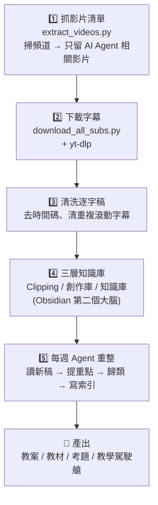
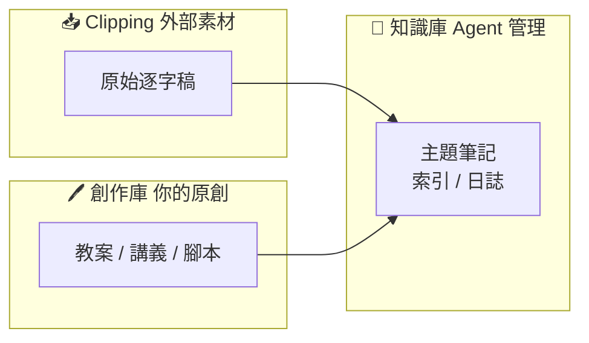

# 工作流秒懂圖表：YouTube 字幕知識庫自動化（你的「第二個大腦」）

> 出處：三師爸 Sense Bar《sensebar-agent-knowledge-vault-builder》工作流（https://github.com/mathruffian-dot/sensebar-agent-knowledge-vault-builder）
> 適用對象：**任何 AI Agent**（Claude Code／Codex／Antigravity／OpenCode），人類讀者亦可直接閱讀。
> 使用方式：使用者說「我不懂這個工作流」時，Agent 讀本檔，用下面這張圖、五個步驟表格、三層結構，帶使用者秒懂。

---

## 一句話看懂

> **把某位老師的 YouTube 影片字幕，自動變成你的「第二個大腦」筆記庫，然後讓 AI Agent 每週自動消化整理，幫你備課、做教案、出考題。**

本工作流出處是另一位老師（三師爸 @sensebar）的做法。整套流程 90% 由電腦自動跑，你只需要在最後看結果、說出你的需求。

---

## 🗺️ 全流程一張圖

---

## 📋 五個步驟速覽表

| 步驟 | 做什麼 | 誰在做 | 產出 | 需要你動手？ |
|------|--------|--------|------|--------------|
| **1** | 掃描頻道所有影片＋直播，用關鍵字（claude、codex、antigravity、opencode、agent）過濾 | 電腦（`extract_videos.py`） | 影片網址清單 + 影片列表 | ❌ 不用 |
| **2** | 逐一讀取清單，用 yt-dlp 下載每支影片的字幕 | 電腦（`download_all_subs.py`） | 原始 VTT 字幕檔 | ❌ 不用 |
| **3** | 去掉 VTT 標頭、時間碼、HTML 標籤，刪掉重複的滾動字幕行 | 電腦（腳本內建清洗規則） | 乾淨的 Markdown 逐字稿 | ❌ 不用 |
| **4** | 把逐字稿放進 Obsidian 三層資料夾 | 你＋電腦（複製貼上） | 第二個大腦結構 | ✅ 5 分鐘 |
| **5** | 每週（如週日）讓 Agent 掃新稿、摘要、歸類、健康檢查、更新索引 | **Agent（我）** | 有條理的知識庫＋教案 | ✅ 下指令 |

> 💡 **整段流程只有兩個地方要你出力**：第 4 步把檔放進 Obsidian、第 5 步下「請重整」指令。其他全部自動。

---

## 🏗️ 三層結構（最關鍵，一定要懂）

| 資料夾 | 放什麼 | 誰能改 | 規則 |
|--------|--------|--------|------|
| `Clipping/` | 別人的影片逐字稿（原始素材） | ❌ 都不改 | **不修改原始檔** |
| `創作庫/` | 你自己寫的教材、講義、腳本 | 你 | **不修改原始檔** |
| `知識庫/` | Agent 整理的主題筆記、索引、日誌、主題資料夾 | **Agent** | Agent 全權管理 |

> **為什麼要分三層？** 把「別人的資料」「你的創作」「整理過的知識」分開，Agent 整理時**永遠不會動到你的原稿**，你最珍貴的素材不會被改壞。

---

## ❓ 每個步驟背後的意義（為什麼要這樣做）

| 步驟 | 為什麼？ |
|------|----------|
| 1️⃣ 過濾影片 | 頻道影片很多，只留「AI Agent」主題，不浪費時間抓無關內容 |
| 2️⃣ 用程式下載 | 64 支影片手動一支支下載太慢，交給電腦排隊跑 |
| 3️⃣ 清洗字幕 | YouTube 自動字幕混了一堆時間碼＋滾動重複文字，不清潔無法閱讀、也無法給 AI 分析 |
| 4️⃣ 建三層庫 | 原始素材／你的創作／整理知識各歸其位，形成可長期累積的「第二個大腦」 |
| 5️⃣ 每週重整 | 新影片不斷增加，定期消化才不會越堆越亂；頻率固定（每週）才好養成習慣 |

---

## ⚡ 怎麼做會更有成效、更有效率（重點筆記）

1. **先跑通一次**：clone 專案 → `pip install yt-dlp` → 跑 `extract_videos.py` → 跑 `download_all_subs.py`，先複製出完整流程，再談優化。
2. **用 .venv 安裝**：不要全域 `pip install`，在自己資料夾建 `.venv`，避免弄髒電腦原有的 Python。
3. **固定每週時段**：把「請重整知識庫」變成每週固定任務（例如每週日），新影片一週一收，庫不會爆。
4. **善用第 5 步的「健康檢查」**：讓 Agent 檢查矛盾內容、壞連結、缺交叉引用，Obsidian 的 Graph View 會像星空圖一樣漂亮。
5. **關鍵字就是你的濾網**：想改主題（例如英語教學 esl、phonics、SoR、reading），只要改 `extract_videos.py` 開頭的 `keywords` 一行字。
6. **換頻道也只要改一行**：把 `extract_videos.py` 裡的 `@sensebar` 換成任何頻道名稱即可。
7. **想換主力 Agent？** 本工作流是「Agent 間交接」設計——同一套腳本與資料夾，Claude Code、Codex、Antigravity、OpenCode 都看得懂，換哪個都行。

---

## 🛠️ 專案裡的檔案（放在本資料夾根目錄）

| 檔案 | 作用 |
|------|------|
| `extract_videos.py` | 掃描 @sensebar 頻道影片＋直播，過濾 AI 相關，輸出網址清單 |
| `download_all_subs.py` | 讀網址清單，下載字幕、清洗、存成 Markdown 到 `Clipping/` |
| `Clipping/` | 逐字稿存放處（不修改） |
| `創作庫/` | 你自己的教材、講義（不修改） |
| `知識庫/` | Agent 管理的結構化知識 |

---

## 🤖 給執行 Agent 的指令

1. 安裝依賴：`pip install yt-dlp`（建議先建 `.venv`）。
2. 跑 `python extract_videos.py` → 得到 `sensebar_ai_urls.txt`。
3. 跑 `python download_all_subs.py` → 逐字稿自動存進 `Clipping/`。
4. 把整個資料夾當成 Obsidian 知識庫開啟（或複製進你原本的 Vault）。
5. 之後固定任務：每週掃 `Clipping/`＋`創作庫/` 新檔 → 摘要歸類進 `知識庫/` → 健康檢查 → 更新索引與日誌。
