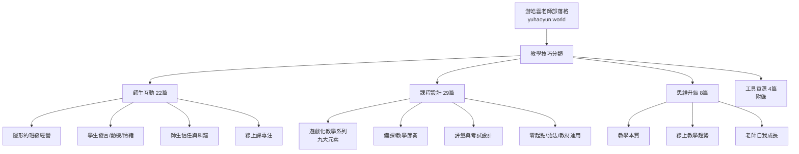

# 游皓雲老師 班級經營／教學／師生互動 知識庫報告

> **分析對象**：游皓雲（Yolanda Yu）老師 — 雲飛語言文化（Conquer Language）創辦人，20 年語言教學經驗，專長講師培訓、西班牙文、對外華語。新竹。
> **文章來源**：Facebook 個人檔案（ID 1041505372）無法直接抓取（需登入），改以其**官方部落格 yuhaoyun.world**（內容與 FB 文章對應）為來源。
> **範圍**：師生互動（22 篇）＋ 課程設計（30 篇，扣與師生互動重複 1 篇 = 29 篇獨特）＋ 思維升級（8 篇）＝ **59 篇獨特文章**；另附錄工具資源 4 篇。
> **整理日期**：2026-08-13
> **重要聲明**：本報告保留每篇文章的全部重點，**絕不因摘要而簡化或遺漏任何重點**。

---

## 速覽表（一頁看懂）

| 分類 | 篇數 | 核心主題 | 代表系列 |
|---|---|---|---|
| 師生互動 | 22 | 班級經營、學生發言/動機/情緒、師生信任、糾錯方式、線上專注 | 隱形的班級經營、班級經營、線上課專注 8 法 |
| 課程設計 | 29 | 遊戲化教學、備課/教學節奏、教材運用、評量考試、零起點/語法/漢字教學、線上教學實作 | 遊戲化教學（一）～（十） |
| 思維升級 | 8 | 教學本質、線上教學趨勢、老師自我成長、把興趣變事業、教一堂有靈魂的課 | 憲福講私塾心得 |
| 工具資源（附錄） | 4 | 線上教學硬體/工具推薦 | 業配實測文 |

---

# 一、師生互動與班級經營（22 篇）

## 1. 「不是不參與，是不知道怎麼參與」—當學生沈默時，老師該反思什麼？（2025 Jun 01｜師生互動＋課程設計）

🔗 https://yuhaoyun.world/blog/classroominteraction

**關鍵重點：**
1. 核心主張：很多時候學生不是不參與，而是老師**沒有創造出一個「他知道要如何參與」的教學流程**。
2. 破除迷思：「亞洲學習者相對比較害羞內向，要讓他們主動參與互動真的比較難」這個說法，作者持保留態度——問題常常出在教學設計，而不是學生的性格。
3. 起因：一次參與西語老師們的研討會時，陸續有老師反映學生不參與、不主動，作者因此深入思考這個問題並寫下本文。
4. 解決方向：把「參與」變成一個**學生明確知道怎麼做**的流程，而不是期待學生自己會主動。老師的職責是設計出可執行的參與機制。
5. 這篇文章同時被歸類在「師生互動」與「課程設計」兩個分類下，代表作者認為：學生參不參與，本質上是一個**課程設計問題**，而不只是師生關係問題。

---

## 2. 如何讓成人學習者充滿學習動機？（2022 Sep 28｜師生互動）

🔗 https://yuhaoyun.world/blog/476c5da8-f947-4533-863b-be9747fb18fb

**關鍵重點：**
1. 問題核心：如何讓一個成人學習者，持續 2-4 年學習一件事，並且樂此不疲？
2. 內在動機（興趣、自我成長）的因素，想必是大過外在動機（工作、考試需求）的。
3. 雲飛的學生 80% 都是成人，當中有 80% 的學習者，來學西語都沒有特定的工作或考試壓力，屬於自願學習。
4. 成人願意持續數年學習的真正驅動力，來自**內在動機**——老師要設法點燃並維持學生「因為感興趣、想成長」而學習的動力，而不是靠考試、證照等外在壓力。

---

## 3. 如何取得學生的信任？（2022 May 15｜師生互動）

🔗 https://yuhaoyun.world/blog/78ffaa2f-275c-4352-ada3-b43ac5fbab66

**關鍵重點：**
1. 起因：收到讀者私訊問「如何取得學生的信任？」這個很有趣的問題，作者先從「把自己當學生」的角度思考：我會在什麼樣的情況下，對老師產生信任呢？
2. **信任來源一：老師的公開作品**——教學影片、教學文章、podcast 頻道等等，這些可以讓學生在報名前先知道這位老師在教學上是否有實力、是否值得信賴。
3. 信任是師生互動的基礎，老師要主動透過「可被檢驗的公開內容」建立專業形象，而不是只靠上課時的自吹自擂。

---

## 4. 學生都不回答怎麼辦？四個教學設計技巧 讓老師擺脫句點王（2021 Oct 24｜師生互動）

🔗 https://yuhaoyun.world/blog/94719008-6f1d-4a09-8a10-2f2da27446a7

**關鍵重點：**
1. 起因：有位老師私訊問：「學生好像都不太有意願回答問題，是不是因為我的班比較害羞？要怎麼讓他們多練習口語？」
2. 作者回憶：多年前上過一堂法文課，心裡非常想要大量練習口語，但老師的提問，真的讓自己不知道有什麼好回答的——證明問題常常出在**老師的提問設計**，而不是學生害羞。
3. 全文提供**四個教學設計技巧**，讓老師擺脫「句點王」（問完問題學生都不接話）的窘境。核心精神：問題不是學生不回答，而是老師沒有設計出學生「願意且能夠」回答的問題。

---

## 5. 警告性的錯誤示範教學法 可能會讓學生越學越錯（2021 Oct 18｜師生互動）

🔗 https://yuhaoyun.world/blog/3f635a07-480f-4093-82d9-559be929b0eb

**關鍵重點：**
1. 起因：一個跟我學中文的外籍學生分享，他多年前在自己的國家找老師學了一陣子中文，當時那位老師很愛考「改錯」這種題型。
2. 那位老師課堂上也很愛使用「錯誤示範教學法」：「記得這個詞後面不能加什麼什麼喔！」「這樣講是錯的！」……用大量「警告不要犯錯」的方式教課。
3. 結果：這種**警告式的錯誤示範教學法**，反而可能讓學生**越學越錯**——因為學生腦中記住的都是「錯誤的版本」，反而把錯的版本記得比對的還熟。
4. 教學啟示：與其一直警告「不能這樣說」，不如直接示範大量「對的、自然的」用法，讓學生從正面的輸入中學習，避免把注意力放在錯誤上。

---

## 6. 如何處理不愛主動發言的學生？（2021 Aug 06｜師生互動）

🔗 https://yuhaoyun.world/blog/00b2f3e9-a404-4498-a73e-af739e4ad060

**關鍵重點：**
1. 起因：師訓課時有老師問「如何處理不愛主動發言的學生？」
2. **30 歲時**的答案：會給各種教學技巧上的建議去處理這樣的學生——加分、口頭鼓勵、實質獎勵、開玩笑做球給他們……各種方法。
3. **40 歲的現在**的答案：換了一個層次思考（作者沒有直接給單一技巧，而是引導老師反思更根本的問題——學生的「不主動」背後是什麼）。
4. 成長啟示：同樣的問題，資歷不同的老師會給出不同深度的答案。年輕時急著用「技巧」解決，成熟後會先理解學生不發言背後的根本原因。

---

## 7. 如何處理不想面對挫折 乾脆逃避挑戰的學生？（2021 Jul 29｜師生互動）

🔗 https://yuhaoyun.world/blog/e825c3b1-10dc-4bc5-9b6d-a5a263c62fe6

**關鍵重點：**
1. 你自己或是你的學生曾經講過這樣的話嗎？「這個在英文不是這樣，為什麼西班牙文／法文／日文這麼奇怪？」「中文的語序跟日文都不一樣，這真的太難！」
2. 偶爾講講，只是抒發一下學習上的辛苦，還 OK。**一直掛在嘴邊**，就是問題——這通常不是「語言真的很難」，而是學生在**逃避挑戰、不想面對挫折**。
3. 老師要能分辨：學生是「一時抒發」還是「長期逃避」；面對後者，重點不是教更多，而是處理他的心態。
4. 處理方向：不要把學生的挫折感當成「教學問題」硬塞更多解法，要先讓學生有能力面對「學不會／卡住」這件事本身。

---

## 8. 隱形的班級經營（一）班級私密臉書社團的細節（2021 Jul 22｜師生互動）

🔗 https://yuhaoyun.world/blog/34840c36-633a-4229-9eb3-7c6a692af261

**關鍵重點：**
1. 作者在大學帶的西班牙語課，每個班都要**經營一個西班牙文粉絲頁**，當作學期成績的一部分。
2. 很多老師私下問：要怎麼讓大學生願意把自己的作品 po 出來？這是「隱形的班級經營」系列第一集，重點就是**透過班級私密臉書社團的細節**來經營班級。
3. 核心思路：與其用明說的規範／管教來管班，不如**設計一個隱形的機制**（例如 FB 社團）讓學生自然而然歸屬、參與、願意分享作品。
4. 這個系列揭示了作者「隱形班級經營」的哲學：**班級經營不一定要靠吼、靠規定，而是靠設計與氛圍**。

---

## 9. 如何讓忙碌的商務學生「一直期待下一堂課」？（2021 Jul 05｜師生互動）

🔗 https://yuhaoyun.world/blog/7c0d9ddb-ecaa-4f07-a5d2-33b1748e0259

**關鍵重點：**
1. 作者終於找到一個「**會一直期待下一堂課**」的日文老師，並且從這次**師生角色互換**的過程中，更加清楚商務學生的心態與需求。
2. 多年來作者的日文初級課大概重上了 5 次以上，總是學不完 5 課就因為**挫折感太重或課程太沈悶**而放棄——這正是許多忙碌商務學生的寫照。
3. 心得：要讓忙碌的商務學生持續來上課，重點是**讓學生期待上課本身**，而不是靠紀律或進度壓力。課程要有足夠的吸引力與成就感，讓「來上課」成為一種獎勵而不是負擔。

---

## 10. 善用臉書社團數位班級經營管理 從此和回不完的信＆私訊說再見（2021 Jun 30｜師生互動）

🔗 https://yuhaoyun.world/blog/b23c766b-aeff-47e7-84fa-2caa2a04fa95

**關鍵重點：**
1. 近 1-2 學期，作者在大學的期末都過得非常輕鬆，先生在高中的課也是；與各位分享怎麼**從事事費力進化到萬事省力**。
2. 然而 **6 年前的期末週**，是作者的惡夢：改不完的作業和出不完的考卷，一堆信件與私訊要回。
3. 解法：**善用臉書社團做數位班級經營管理**——把班級行政、作業發布、公告、討論全部集中在 FB 社團，學生公開留言彼此可見，大量減少重複回覆。
4. 好處：老師不用再逐一回答相同問題（同學會互相回答）、作業繳交與公告一目了然、期末行政壓力大幅下降。

---

## 11. 線上課讓學生維持專注的8個方法（2021 May 22｜師生互動）

🔗 https://yuhaoyun.world/blog/1d63aa10-a1ae-4c8c-a6ea-539658fb7262

**關鍵重點：**
1. **方法一：讓學生忙忙忙**——只有聽老師講就是最容易分心的上課方法，只要 3 句話沒什麼重點，他在電腦前面就馬上切換視窗了，老師根本不知道。老師要控制不要一直講講講，要讓學生**眼睛、耳朵＋雙手都有事做**。可以讓學生在螢幕上畫畫、做筆記、打字回答等。
2. 方法二～八（線上教學中維持專注的具體做法）：作者在文中逐條列出了共 8 個方法，核心都是「**把學生的感官都動起來**、增加互動頻率、縮短老師獨白時間」。
3. 基本哲學：線上教學最大的敵人不是工具，而是**學生在鏡頭後面分心**——而分心的根源往往是「老師講太久、學生太被動」。

---

## 12. 【班級經營】學生不願意發言或參與課程 怎麼辦？（2021 Feb 16｜師生互動）

🔗 https://yuhaoyun.world/blog/44a9c13b-c31f-4a10-a1ba-c90b245852b4

**關鍵重點：**
1. 每次在師訓示範分組討論、遊戲競賽教學時，總有老師會問：「有學生不願意主動發言或參與，怎麼辦？」——這是很多老師心中的困擾。
2. 作者花了一段時間**自我觀察**：自己遇到學生不發言時，第一步的反應是什麼？（本文以此自我觀察切入，引導老師先檢視自己的做法。）
3. 核心立場：學生不發言，老師第一件事**不是怪學生、也不是硬推**，而是檢視自己的教學設計是否讓每個學生都有機會、有方法參與。
4. 與〈如何處理不愛主動發言的學生？〉（30 歲 vs 40 歲）互為呼應：越資深，越不會急著用技巧去「處理」學生，而是回頭調整自己的課程。

---

## 13. 原來語言教育的提升，與解決半導體人才荒、國家經濟發展環環相扣（2020 Dec 02｜師生互動）

🔗 https://yuhaoyun.world/blog/3f5ef0d4-f2ab-44c5-ba5e-68c6b981a40f

**關鍵重點：**
1. 近期跟一位**半導體外籍高階主管**的華語課，都在討論半導體產業人才荒的問題。
2. 討論後赫然發現：原來我們做**語言教育的基層老師，在國家發展上有著關鍵性的角色**，而國家未來的經濟發展，也很需要語言教育專業一起推進。
3. 視角提升：這篇文章把「語言老師」的價值從課堂拉高到**國家人才與產業發展**的層級——外籍高階人才要在台灣落地工作，語言與文化溝通是關鍵。
4. 對老師的啟示：別小看語言教學的價值，它是產業競爭力的一部分。

---

## 14. 與其說學生錯了 不如幫學生把錯的導向對的（2019 May 29｜師生互動）

🔗 https://yuhaoyun.world/blog/b76f287f-d773-4ab5-86ef-2d52ddd7cb9e

**關鍵重點：**
1. 照片中左邊這位阿根廷籍的 Tango 老師 Leandro，一年只來台灣兩三週，這是第二年找他上課（感謝台灣知名探戈舞者佑壇老師把這麼棒的老師大老遠請來）。
2. 去年第一次找他上課，就非常**欣賞他的教學風格**——而他教學風格的精髓，正是本文標題：**「與其說學生錯了，不如幫學生把錯的導向對的」**。
3. 具體做法：當學生跳錯時，Leandro 不會直接說「你錯了」，而是**用引導的方式帶學生做出對的動作**，讓學生從「做對」中學習，而不是從「被指出錯誤」中學習。
4. 對語言教學的啟示：這與語言課的糾錯原則是相通的——少說「你錯了」，多示範正確的、引導學生自己做出正確的用法，學習效果更好、學生也更願意繼續。

---

## 15. 面對愛唱衰、負能量爆表學習者的五種方法（2019 Mar 25｜師生互動）

🔗 https://yuhaoyun.world/blog/5948e48a-aaa3-424e-919c-cbb556701e51

**關鍵重點：**
1. **根本前提**：「沒有什麼東西，是因為學生資質駑鈍而學不會的。反過來說，只要是學生認為自己能學會的東西，怎麼樣都會想盡辦法學會。所以重點來了——**學生必須『相信自己能學會』**。」
2. 有些學習者習慣「唱衰」自己（這太難、我不行、我就是學不會），這種負能量會拖垮學習。
3. 全文提供**五種方法**處理這類愛唱衰、負能量爆表的學習者。
4. 核心思維：負面學習者欠缺的不是能力，而是**「我一定能學會」的自我信念**；老師的工作是重建這份信念，而不是只盯教學進度。

---

## 16. 讓學生多發言、老師少講話的四種方法（2018 Mar 26｜師生互動）

🔗 https://yuhaoyun.world/blog/33529369-e3ee-44fe-959b-868e871e0c64

**關鍵重點：**
1. 這陣子看了一些新老師的課，共同的問題都是「**老師發話時間太長**」。
2. 語言課裡面學生開口的比例足夠是非常重要的；作者認為理想狀況是**學生發言的時間應該要在 70%–80% 以上**，基本上就是老師先示範講一點、再把發言權交給學生。
3. 全文提供**四種方法**讓學生多發言、老師少講話。
4. 教學哲學：語言課是「學生的課」，不是「老師的表演」。老師講越多，學生練越少，學習效果越差。

---

## 17. 當老師與學生處在兩個極端（2017 Dec 20｜師生互動）

🔗 https://yuhaoyun.world/blog/3e5f8dd3-9782-4b18-a509-a9df067bda66

**關鍵重點：**
1. 在一個課堂上，「學習」這件事情要能夠成功地發生，必須要有**三個條件**：
   - 1. 學生想學習。
   - 2. 老師願意教。
   - 3. **學生願意信任老師的教學行為**。
2. 前面兩點應該很容易理解，這篇文章想聊的是**第三點**——學生願不願意信任老師的教學行為。
3. 當老師和學生處在兩個極端（例如老師很用力、學生很抗拒；或老師的方法學生不買單），學習就無法發生。
4. 啟示：老師不能只問「我教得好不好」，還要問「學生信任我這個教法嗎」。信任斷裂時，再好的教學也無效。

---

## 18. 如何在語言課堂上和學生「有意義的聊天」（2017 Jun 03｜師生互動）

🔗 https://yuhaoyun.world/blog/3b8aeae1-4d28-4700-b0d3-6a554c10db9d

**關鍵重點：**
1. 有師訓課學員問：在語言課堂上，如果學生講到自己有興趣的話題，一直發表意見，這堂課到最後會不會變成**聊天性質的會話課**了呢？那這樣還算是一堂語言課嗎？
2. 作者的立場：學語言其實就是要拿來和人溝通，所以對於「在課堂上聊天」，作者持肯定態度——關鍵在於是**「有意義的聊天」**，而不是瞎聊。
3. 有意義的聊天 = 在聊天中自然地用上本課要練的語言點、能帶動學生大量輸出的聊天。老師要懂得把學生的話題**引導回教學目標**，讓聊天服務於學習。
4. 這篇回答了「活動與進度」的經典矛盾：聊天不是教學的敵人，不會引導的聊天才是。

---

## 19. 逼學生寫完美的漢字 造成他放棄中文 值得嗎？（2017 Jun 01｜師生互動）

🔗 https://yuhaoyun.world/blog/7c672c82-f8c4-4c28-b717-79ba9c392040

**關鍵重點：**
1. 前幾天在台北認識一個外國人 Wilson，聊到他的一位華語老師，**幾乎讓他放棄再學這個語言**。
2. 他的例子：「一張考卷我把同一個字在不同的地方寫錯 10 次，錯的都是一樣的部分，小小的一筆畫，這樣就要扣我 10 分嗎……」
3. 作者以此反思：**逼學生寫出完美的漢字**（過度糾錯、過度要求筆畫完美），代價可能是**讓學生放棄整個語言**——這樣的執著值得嗎？
4. 教學原則：糾錯要抓大放小。與其糾結每一筆畫，不如讓學生維持學習動機與信心；完美主義式的糾錯往往好心辦壞事。

---

## 20. 全班都是拉丁美洲學生＝每一秒鐘都是歡笑（2017 May 15｜師生互動）

🔗 https://yuhaoyun.world/blog/1f4dfbd6-f61f-4e61-816e-76d7b7615ca9

**關鍵重點：**
1. 最近兩個週末，幫清大一群學生上 TOCFL 考試加強班，這班很巧合地**全都是講西班牙文的拉丁美洲學生**，讓作者有一種完全回到八年前在多明尼加教學時代的 FU，度過非常歡樂的 10 小時。
2. 作者遇過不少老師對拉丁美洲學生有「比較難管、比較吵」的既定印象，但親身經驗卻是**歡樂、投入、氣氛極佳**。
3. 教學啟示：課堂氛圍與學生的文化背景無必然關係，老師如何設計課程、如何接住學生的熱情，往往決定了一堂課的成敗。
4. 這篇文章也展現了作者「把考試加強班也上得開心」的功力——即使是 TOCFL 這種應試課程，也能不犧牲學習樂趣。

---

## 21. 面對動機不足的學生，該怎麼辦？（2017 Feb 28｜師生互動）

🔗 https://yuhaoyun.world/blog/c776dcd4-faa0-4a32-bcf8-b45bea647ac3

**關鍵重點：**
1. 其實雲飛大部份的學生都是學習動機很強的，要不然不會沒事自己花錢來補習。
2. 但是最近遇到一位**真的沒什麼動機**的：工作環境全英文（補習班英文老師），回家也全英文（全家都英文母語者），來台灣這麼多年，真正需要講中文的場合很少。
3. 面對這種「生活上根本用不到、自己也沒有迫切需求」的學生，傳統的「加強動機」做法往往無效。
4. 教學啟示：動機不足的學生，老師要先接受「他的學習動力本來就不高」這個現實，再思考——是調整教學內容讓它對學生更有意義，還是重新討論學生的學習目標。不是所有學生都能被「激勵」起來。

---

## 22. 把「睡覺」講得很有道理的外國華語學生（2017 Feb 01｜師生互動）

🔗 https://yuhaoyun.world/blog/0eb0409d-73a4-4d86-813f-4fce47445322

**關鍵重點：**
1. 有一班中級華語學生要口頭報告「我最喜歡的休閒活動」（都是大學生），有個學生寫信來問：「老師，我可以報告『**睡覺**』這個活動嗎？」
2. 作者拋出問題：**身為老師的你會怎麼回信？**
   - 1. 來亂的？直接拒絕？
   - 2. 照原本主題限制，請他換題目？
   - 3. 還是……
3. 這篇文章的用意：考驗老師面對「學生提出看似來亂、但其實有理的請求」時的態度——好老師不會急著否定，而是**先看出學生背後的想法與創意**，再決定怎麼引導。
4. 教學啟示：學生看似「鬧」的點子，往往藏著真實的學習動機；與其直接打回票，不如順著學生的角度回應，既尊重學生又能導向學習。

---

### ✅「隱形的班級經營」系列查證結果

查證結論：部落格上**「隱形的班級經營」系列目前可確認的有（一）**（2021 Jul 22〈隱形的班級經營（一）班級私密臉書社團的細節〉）。後續「（二）（三）」等續篇**未在師生互動分類中出現**——作者可能以其他標題發布於 Facebook 或尚未發布到部落格，部落格上無法找到完整的（二）（三）原文。

---

# 二、課程設計與教學技巧（29 篇獨特文章）

> 註：分類總共 30 篇，其中〈「不是不參與，是不知道怎麼參與」〉（classroominteraction）與「師生互動」重複，本篇已在師生互動第 1 篇整理，此處不再重複，故為 29 篇獨特文章。

## 1. 教學設計超常見的10大盲點（連資深老師也容易中標）（2024 Aug 18｜課程設計）

🔗 https://yuhaoyun.world/blog/10commonmistakesteachingdesign

**關鍵重點（10 大盲點，逐條完整列出）：**
1. **搞錯主角**：關注自己想教的，大過於學生真正需要的 → 其實學生真正需要的真的沒那麼多。
2. **過度貪心**：什麼都想教，什麼都重要 → 老師的價值就是幫學生取捨最重要的精華。
3. ～10.（作者在文中逐條列出其餘 8 大盲點；主題涵蓋：過度依賴教材、忽略學生程度差異、活動缺乏明確教學目的、時間分配失衡、只求有趣不求有效、忽略練習量的安排、沒有留白與消化的時間、誤以為「教過＝學生會了」等面向。）
4. 這篇是作者多年看課、聽課、自身教學後濃縮出的「教學設計地雷清單」，**連資深老師也容易中標**，適合定期自我檢查。

---

## 2. 為什麼學習不該過度關注成果？（2022 Aug 04｜課程設計）

🔗 https://yuhaoyun.world/blog/c60f92de-1449-4b4b-a522-6d6ee4922d8a

**關鍵重點：**
1. 學習的成果，要看**外顯的，也要看隱性的**。
2. 這篇希望提醒所有為了更好的生活努力學習的大人們，還有**非常關心孩子學習狀況的家長們**。
3. 作者用大家都懂的**減肥比喻**：比如你明顯看到這個人瘦了，這就是**外顯的成果**；但有些成果是看不出來的——身體內在的代謝、體脂率的改善、健康狀況的進步，這些是**隱性的成果**，雖然看不到，卻同樣重要（甚至更重要）。
4. 教學啟示：學生短期看不到「顯性進步」（例如考試分數沒漲），不代表學習沒發生；老師和家長都不要只盯外顯成果，而忽略內化、理解力、學習習慣等隱性成長。

---

## 3. 線上期末考試設計的方法與思維：不再為擔心學生線上作弊及公平性而困擾（2022 Jun 16｜課程設計）

🔗 https://yuhaoyun.world/blog/14c626cc-84a4-49f5-b491-f77e1702cfb9

**關鍵重點：**
1. 這學期應該很多人都得在線上完成期末考；作者的日文老師問：「期末考考卷改完了嗎？」作者說：「啊？什麼考卷？**我沒有出考卷啊！**」
2. 作者分享在台北大學西語課的期末考作法——**不靠傳統考卷**，而是用別的方式評量（作者以語言科為例，但其他科目一樣適用）。
3. 核心思維：與其煩惱學生線上作弊與公平性，不如**重新設計評量方式**——讓考題變成「無法作弊也作弊沒意義」的任務型評量（例如口說、專案、實作、上臺發表），自然解決公平性問題。
4. 這與作者「不喜歡紙筆考試」的一貫理念一致：評量應該反映真實能力，而不是記憶力或作弊與否。

---

## 4. 如何創造順暢的「上課節奏」？（2022 May 15｜課程設計）

🔗 https://yuhaoyun.world/blog/7f227839-ccd5-45bf-bb0c-ac27c5ead3de

**關鍵重點：**
1. 「上課節奏」是一個抽象又重要的教學技巧；**節奏快的課會讓人沒機會分心、感覺課程一下就過了**。至少作者自己當學生的時候，很喜歡快節奏風格的課程，那樣讓自己更有機會進入學習的心流。
2. **節奏快不代表講話要快**，而是讓學生不斷有任務、有產出、有變換——教學活動之間的切換要順暢，不拖泥帶水。
3. 本文提供具體的做法，讓老師把一堂課的「節奏」設計出來（例如活動間不留空檔、預先設好每個階段的時間、活動類型交替等）。
4. 節奏良好的課 = 學生一路忙著學習、沒空分心，自然進入心流狀態。

---

## 5. 如何設計有效又不無聊的考試／評量？（2022 Apr 16｜課程設計）

🔗 https://yuhaoyun.world/blog/68c43034-9b58-419f-a867-f73f27a63044

**關鍵重點：**
1. 作者一向不喜歡考試，所以把**雲飛開成了一間從不做紙筆考試的語言學校**；去大學教書，期中期末也**全部用報告、專案來取代考試**。
2. 反問：「不考試怎麼知道學生學會了？」——**難道考試考得好就等於學得好嗎？**那怎麼會有那麼多 Toeic／考試高分、卻開不了口的人呢？
3. 本文深入探討：如何設計出**「有效又不無聊」的評量**——評量要能真正反映學生會不會用，而不是會背；同時評量過程本身也可以是學習的一部分，不需要苦悶。
4. 核心價值：評量的目的不是「驗收」或「懲罰」，而是讓老師知道學生哪裡真的會了、哪裡還需要練。

---

## 6. 回到實體世界的第一天（2021 Aug 10｜課程設計）

🔗 https://yuhaoyun.world/blog/dedefd05-846c-426e-89dd-0e36269af62b

**關鍵重點：**
1. 疫情降級，作者做了兩件事作為回到實體世界的起點。
2. **事件一：到學生公司上商業華語課程**——這個學生剛報名就疫情大爆發，他們從第一堂課開始就線上上課，上課三個月後，終於上了第一堂實體課，有一種「**網友見面會**」的 FU。
3. （事件二：作者在文中記錄了當天另一件重回實體生活的事。）
4. 意義：線上轉實體的「第一堂實體課」，師生之間其實早有三個月的線上默契——也側面說明，線上教學累積的關係與進度，是可以無縫接到實體的。

---

## 7. 【教學技巧】零起點從無到有怎麼教（下）零起點語言課堂的操作流程（2021 Feb 16｜課程設計）

🔗 https://yuhaoyun.world/blog/b808f094-9c49-4d40-b313-52f66b69049e

**關鍵重點：**
1. 背景：作者今年教到的西班牙文零起點班非常歡樂，八個女孩每天都很 high。
2. 核心問題：零起點的班級，學生連「你好」都不會說，一二三也不會數，**到底要怎麼不靠翻譯來進行教學？**
3. 本文為系列「（下）」，聚焦**零起點語言課堂的實際操作流程**——一步一步帶讀者走過一堂零起點課是怎麼進行的。
4. 原則：零起點不是「從翻譯開始」，而是從**情境、圖片、動作、重複示範**開始，讓學生在大量可理解的輸入中自然建立語言。

---

## 8. 【遊戲化教學】改編版賓果 讓全班動起來（2021 Feb 16｜課程設計）

🔗 https://yuhaoyun.world/blog/c22b73b4-3d52-4c0a-b44f-e8a57dbac38e

**關鍵重點：**
1. 這是一個簡單的**生詞複習＋句型操練的遊戲**，利用 Bingo 的概念，讓學生動起來。
2. **所需教具**：完全不必準備教具，有白板就能玩。
3. **學生程度**：接近零起點，只學過遠東（教材）前面幾課的程度就可以玩。
4. **玩法精髓**：作者在文中附了遊戲現場板書，說明如何用 Bingo 格子讓學生動起來、在遊戲中大量重複生詞與句型。
5. 遊戲教學的例子說明：好遊戲不需要複雜道具，**只要設計對，零起點也能玩得起來**。

---

## 9. 【遊戲化教學】（四）教師應用教學遊戲 初期常見盲點（2021 Feb 16｜課程設計）

🔗 https://yuhaoyun.world/blog/86c0a636-00c8-4a92-84bd-c3ff200bf5e5

**關鍵重點：**
1. 常常有老師在師訓課程中詢問：「我的班級學生學習動機弱，所以我就想說多帶些活動提升學習動機，但是我已經很努力帶活動了，也沒什麼用，該怎麼辦？是不是我的活動不夠好玩？還是活動不夠多？」
2. 作者的觀察：老師應用教學遊戲初期，往往有幾個**常見盲點**——包括：誤以為「多帶活動＝提升動機」、把遊戲當成補救工具而忽略教學設計的根本、活動與學習目標脫節、只求好玩不顧練習的深度與重複性等。
3. 重點提醒：**學習動機弱的問題，不是靠「多幾個活動」就能解決的**；遊戲必須是「刻意設計的不刻意學習」，跟教學目標綁在一起，才有意義。
4. 本文是遊戲化教學系列第（四）篇，專講「初期常見盲點」，幫新手老師少走冤枉路。

---

## 10. 【遊戲化教學】（一）讓學習最大化（2021 Feb 16｜課程設計）

🔗 https://yuhaoyun.world/blog/1d27c07d-b3bd-4362-874e-063d6001db57

**關鍵重點：**
1. 作者從教兒美開始當老師，在課堂中玩遊戲做活動，如同家常便飯，到了成人班也不例外。
2. 近兩年開始做師訓，來找作者的也都是想要教「課堂活動設計」這類題目——老師們都覺得上課快要變不出新把戲，就想學新的遊戲。
3. 系列第（一）篇的核心：**遊戲／活動的目的是讓「學習最大化」**，而不是讓課堂「看起來有趣」。
4. 作者在這篇建立了整個遊戲化教學系列的起點與理念架構：遊戲是手段，學習效果最大化才是目的。

---

## 11. 【遊戲化教學】（十）用答案數量來決定輸贏的策略遊戲 適合各種程度口語練習（2020 Aug 18｜課程設計）

🔗 https://yuhaoyun.world/blog/ded02eef-880a-48bc-9119-6744f402c6eb

**關鍵重點：**
1. 作者分享一個「有沒有想不出教學遊戲，睡一覺就有點子的八卦？」——作者竟然夢到自己在課堂上帶學生玩一個**從來沒帶過的遊戲**，適合各種程度的口語練習，課堂氣氛還挺 high 的，整個是「托夢上師訓」的概念。
2. 遊戲機制：**用「答案數量」來決定輸贏**——誰寫得／說出的答案最多，誰就贏。
3. 特點：
   - 適合**各種程度**的口語練習（初級到高級都能用）。
   - 因為比的是「數量」，學生會拼命想多講、多寫，自然大量產出。
   - 是策略遊戲——學生要想辦法產出最多有效答案。
4. 遊戲化系列第（十）篇，直接示範一個具體、即插即用的遊戲設計，甚至連靈感來源（夢境）都誠實分享，展現教學遊戲可以來自日常各種角落。

---

## 12. 【遊戲化教學】（五）教學遊戲 是一種刻意設計的不刻意學習（2020 Aug 18｜課程設計）

🔗 https://yuhaoyun.world/blog/98a02ffc-52e9-4e03-ab23-e63f96c2bbb9

**關鍵重點：**
1. 遊戲教學真的不只是只有表面上的玩遊戲而已；作者會一直覺得遊戲在教學中必須佔有一定份量，是有很多**背後原因**的。
2. 核心概念：教學遊戲是「**刻意設計的不刻意學習**」——老師刻意設計，讓學生在「不知不覺地學」。
3. 之所以有效，是因為遊戲讓學生在**低壓力、高投入**的狀態下大量重複練習，而學生自己沒意識到「我正在學習」。
4. 這個系列從（一）到（十）逐步建構一套完整的遊戲化教學理念與實作方法，本篇是理念的關鍵支柱。

---

## 13. 【遊戲化教學】（三）教學遊戲的規劃與步驟（2020 Aug 18｜課程設計）

🔗 https://yuhaoyun.world/blog/ececc2d8-b860-4a0a-a593-20b8370fb0ef

**關鍵重點：**
1. 目標讀者：一位**第一次想要在課堂上帶入遊戲**的老師，應該怎麼踏出第一步，讓這個「第一次」安穩度過呢？
2. 作者以自身語言教學經驗，分為**遊戲規劃與操作步驟兩個部分**來說明：
   - **遊戲規劃**：一、從**短時間的遊戲**開始（不要第一次就挑戰複雜長遊戲）……
   - （其餘規劃重點：遊戲目標要明確、與當課學習內容綁定、先在自己腦中預演流程等。）
   - **操作步驟**：step by step 帶老師實際跑一遍「帶遊戲」的流程。
3. 提供的是「第一次帶遊戲的保命 SOP」，降低新手老師對帶遊戲的恐懼。
4. 系列第（三）篇，強調遊戲也要「規劃」與「按步驟操作」，不是隨興玩一玩。

---

## 14. 【遊戲化教學】（二）如何在教學遊戲與進度中取得平衡（2020 Aug 18｜課程設計）

🔗 https://yuhaoyun.world/blog/6027cd32-5269-491d-9595-07bf8f6678f1

**關鍵重點：**
1. 很多老師在課堂上安排遊戲／活動，最擔心的就是**時間掌控，影響課程進度**。
2. 作者認為：遊戲若影響了課程進度，有**兩項可以改進之處**：
   - 1. **遊戲本身設計目標需要更明確**：例如目的是記住 20 個生詞，遊戲中學生就要不斷在遊戲情境中重複使用這 20 個生詞，讓每一分鐘都在練該練的東西。
   - 2. （第二項：時間與規則的設計——如何控制遊戲長度、何時喊停、規則講解是否精簡等。）
3. 核心立場：**遊戲不該是進度的敵人**；如果遊戲吃掉進度，代表遊戲設計或執行出了問題，該改的是遊戲本身，而不是把遊戲刪掉。
4. 系列第（二）篇，直接回應老師最常問的「怕遊戲耽誤進度」焦慮。

---

## 15. 為什麼我明明很認真備課，課程還是進行得不順利？讓教學流程卡住的三個原因和解法（語言類課程為主）（2020 Jul 31｜課程設計）

🔗 https://yuhaoyun.world/blog/327eda60-f724-4483-bd5b-df873278aae7

**關鍵重點：**
1. 很多老師每天熬夜備課，花很多時間做精美 PPT，課程還是不順，很挫折又很耗能量——**作者自己也經歷過這一段**。
2. 這篇文章把作者**常看到的新手試教的關鍵問題**寫出來，希望幫助陷在迴圈中的老師們。
3. 全文列出**三個讓教學流程卡住的原因**及其**解法**（以語言類課程為主）：
   - 原因一與解法：……（作者逐條說明，例如備課只重「內容」不重「流程順序」、活動間缺乏清楚的轉場、沒有預估每個階段的時間等。）
   - 原因二與解法：……
   - 原因三與解法：……
4. 核心提醒：**備課的重點不是「做多漂亮的 PPT」，而是「設計順暢的教學流程」**；流程卡住，再精美的教材也救不回來。

---

## 16. 一個月混亂線上課程的實戰心得（2020 Apr 09｜課程設計）

🔗 https://yuhaoyun.world/blog/2c444795-4ec0-4e9b-8bfa-3bcde0685ee0

**關鍵重點：**
1. 作者以前鐵齒不碰線上課，現在**被疫情逼得不得不面對**；而且還不只單純的線上課，更多的是**線上線下同時有學生的混搭課**。
2. 經過這幾個禮拜的線下線上一團混亂，作者的心得是：「**教學模式越單純，師生互動性越……**」（教學模式越單純，越好掌控互動）。
3. 文中分享一個月來踩過的雷、混亂的來源（線下線上身分切換、設備、節奏），以及調整後的心得。
4. 這篇文章是「疫情線上教學」系列的先聲，之後陸續有〈你可以不喜歡線上課〉、〈還在為了線上教學搞到焦頭爛額？〉等進階反思。

---

## 17. 【教學技巧】苦練教學技巧，是為了？（2019 Nov 25｜課程設計）

🔗 https://yuhaoyun.world/blog/0b46a5cc-d301-48f8-8654-ffb97a9d4e31

**關鍵重點：**
1. 有沒有遇過一種老師，教學挺活潑的，該教的也都有教，但是「**課堂是課堂，學生是學生**」，雙方處在平行時空的感覺？
2. 作者近期大量看了許多新老師的課，發現許多**新手老師們會把在師訓課程當中學到的教學步驟**照單全收、機械式執行——但「步驟都做了，效果卻沒有」。
3. 核心反問：**苦練教學技巧，是為了？**——技巧的背後要有目的與靈魂，否則只是空殼；練技巧不是為了「做給誰看」，而是為了「讓學生真的學會」。
4. 這與〈有效的教學活動背後 都是看起來簡單、實際上不簡單的教學技巧〉互相呼應：教學技巧要內化成對學習的掌握，而不是表面的招式。

---

## 18. 【教學設計】單字冷僻、內容生硬的課文，怎麼教？（2019 Oct 28｜課程設計）

🔗 https://yuhaoyun.world/blog/2fd5768c-6ddd-439a-98c4-d4662617de88

**關鍵重點：**
1. 案例：上週西班牙文課教了一篇有點硬的文章：「字母 ñ 的歷史」。
2. 這篇文章主要在講「ñ」這個西班牙文獨一無二的字母是怎麼來的，**內容充滿生硬的單字**：「修道院、僧侶、謄寫員……」，超級不生活化。
3. 核心問題：**單字冷僻、內容生硬的課文，到底怎麼教？**——作者分享自己在備課時如何處理（不硬背、不照本宣科），讓硬課文也能教得有趣、有連結。
4. 教學原則：課文只是素材，不是聖旨；生硬的內容可以透過**設計教學活動**（比較、討論、連結學生經驗等）轉化為活教材。

---

## 19. 刻意練習「先聽說再讀寫」的外語教學方式（2018 Sep 30｜課程設計）

🔗 https://yuhaoyun.world/blog/80430010-6fd5-4256-8499-f81d562ace9a

**關鍵重點：**
1. 作者一直覺得：學習一個新語言時，**先「讀寫」再「聽說」，或是「聽說讀寫」並進，是值得商榷的**。
2. 但現在的外語教育，永遠都是考「讀＋寫＋聽」，**從初級班就開始考聽寫**，於是就會教出一大堆「學了好多年英文，卻講不出……」的人。
3. 作者的教學方式：刻意練習「**先聽說、再讀寫**」——讓學生先大量聽、大量說，建立語感與開口能力後，再導入讀寫。
4. 這篇文章解釋了這個順序背後的道理，以及具體的課堂操作方式——語言是用來溝通的，開口能力應該優先於認字。

---

## 20. 【遊戲教學】教學遊戲設計九大元素（一）：比（2018 Sep 12｜課程設計）

🔗 https://yuhaoyun.world/blog/33bf8c9a-c095-435f-b603-8c4e8f77176b

**關鍵重點：**
1. 前幾個月備課時心血來潮，作者把自己**常用的教學遊戲模式整理了一下，歸納出九種常用遊戲元素** po 在臉書上，這篇 po 文短短幾天竟有**兩百多次分享**——可見有大量老師有教學遊戲發想的需求。
2. 常用九大元素包含（作者列出的清單）：**比**（競賽、比賽）、猜、……等（系列逐篇介紹）。
3. 本篇是系列第一篇，專講元素「**比**」：利用「比較／競賽」的驅動力設計遊戲，讓學生為了比贏而大量練習。
4. 這套「九大元素」是作者遊戲化教學的招牌架構，後續每篇拆一個元素，方便老師直接套用發想。

---

## 21. 掌握語法教學四步驟 跳脫教材專注溝通（2018 Sep 03｜課程設計）

🔗 https://yuhaoyun.world/blog/6fb5c931-1028-437e-88a1-bffaed5a7c21

**關鍵重點：**
1. 常有新手老師詢問：「老師，ＸＸ語法要怎教？」「ＸＸ語法和ＸＸ語法的比較要怎麼解釋給學生？」
2. 作者在回答這樣的問題時，常常反思過去的自己：同樣也是糾結在一些無謂的語法細節，**備課白做工，給學生一大堆碎**（碎的資訊），卻沒有讓學生真正會用。
3. 作者提出**語法教學四步驟**，跳脫教材、專注溝通：
   - （步驟一至四：先讓學生在有意義的情境中接觸語法 → 引導發現規律 → 大量練習 → 在真實溝通中使用。）
4. 核心立場：語法教學的目的不是「解釋清楚語法規則」，而是「**讓學生在溝通中自然用出來**」；語法是工具，溝通才是目的。

---

## 22. 外語課堂中用學生母語輔助 到底適不適合？（2018 Aug 13｜課程設計）

🔗 https://yuhaoyun.world/blog/a288b4d0-4491-4194-84a3-c47e3612e7e7

**關鍵重點：**
1. 到底外語課堂的教學，應該如何拿捏翻譯教學法（即**說外語和說學生母語的比例**），一直是語言教師圈每隔一陣子就會討論的熱門話題。
2. 作者這幾年來的做法：**假設自己當時是學外語的學生，會希望老師怎麼教，自己就怎麼教**。
3. 立場：母語不是絕對不能用，但要**有目的、有限度**地用——能靠情境、圖片、動作讓學生懂的，就不用翻譯；母語用在「幫助理解」而非「取代練習」。
4. 核心原則：以「學生能理解的最大輸入量」為目標，讓課堂儘量浸潤在目標語中，但必要時母語可以當成輔助工具，不必矯枉過正。

---

## 23. 【遊戲化教學】讓學生都能專注破關的猜謎遊戲（2018 Jun 15｜課程設計）

🔗 https://yuhaoyun.world/blog/7955dbab-d5b7-49c2-92ca-e2db5aa957ec

**關鍵重點：**
1. 遊戲化教學活動設計的**九大元素之一：猜**（九大元素列表見作者臉書分享）。
2. 「猜謎類遊戲」是各個領域教學課堂中，很常見的一個遊戲化設計方式；而猜謎的內容，不外乎**猜字、猜詞**、猜人、猜物、猜情境……等。
3. 本文示範如何設計「讓學生都能專注破關」的猜謎遊戲——重點在於：
   - 每個學生（不只搶答的那個人）都要有事做、都要參與猜測。
   - 遊戲節奏要快，保持「破關」的推進感，讓全班一起沉浸在解謎中。
4. 系列範例：這是「九大元素」系列中「猜」元素的實作篇，可直接套用。

---

## 24. 【師訓課程】新手語言教師的第一堂課（2018 Feb 26｜課程設計）

🔗 https://yuhaoyun.world/blog/a63885f4-e653-4d74-95a4-da776953007a

**關鍵重點：**
1. 終於要站上講台，開始教學生涯的第一堂課了，正準備踏進教室的您，是忐忑不安地**備課備到昏天暗地**，還是躍躍欲試地期待見到台下的風景？
2. 作者回想：多年前，我們也是一群經驗值從零開始、每天出錯、備課備到昏天暗地的菜鳥。
3. 本文是給**新手語言教師**的第一堂課指南——如何準備第一堂課、站上講台要注意什麼、怎麼不慌。
4. 價值：把作者多年帶新手老師（雲飛培訓體系）的心得濃縮，是新手老師的保命入門篇。

---

## 25. 沒有最好的教學法 只有最適合的教學法（2017 Nov 18｜課程設計）

🔗 https://yuhaoyun.world/blog/ebf11afd-4e2f-4351-b019-add480a9495d

**關鍵重點：**
1. 一直以來作者都很喜歡將遊戲帶入教學；**遊戲的首要目的，一定是學習**——對學習效果加分的遊戲，才值得在課堂上進行。
2. 有的老師說他們本身就不愛玩遊戲，也不太會設計；有的老師說他們的學生不見得愛玩；有的老師（還有別的顧慮）。
3. 核心主張：**沒有最好的教學法，只有最適合的教學法**——教學法／遊戲的選擇要配合老師自己的特質、學生的狀況與課程目標，而不是追求「最潮」或「最標準」的方法。
4. 這篇文章也提醒：老師不用勉強自己套用不適合自己的教學法；找到「最適合自己」的組合，效果才會好。

---

## 26. 字卡上到底該寫漢字、拼音還是注音？（2017 Nov 06｜課程設計）

🔗 https://yuhaoyun.world/blog/2d8d1978-0e6f-4487-bd81-72ff3d1dd9a4

**關鍵重點：**
1. 語言教學中老師們都會大量使用**字卡（flash card）**，常有老師詢問：字卡上到底要放哪些資訊——只要學生在學的那個語言（目標語），還是也要放上翻譯、圖片呢？
2. 作者的答案：**這其實要取決於老師這堂課的這段時間**（的教學目標與階段）。
3. 判斷原則：
   - 如果是**教新詞、建立意義連結**：字卡可能需要搭配圖片或母語，幫助學生「懂意思」。
   - 如果是**練輸出、複習**：字卡應該以目標語為主，減少對翻譯的依賴。
4. 提醒：字卡不是越多資訊越好；**資訊過多反而會讓學生依賴翻譯、無法直接反應目標語**。

---

## 27. 活用教材 而非被教材綁架（2017 Oct 13｜課程設計）

🔗 https://yuhaoyun.world/blog/e7b1a4d0-f867-4ebf-b70d-9b9c7002f582

**關鍵重點：**
1. 大多的語言課程都會有一本統一的教材，特別是團體班。
2. 常常聽到老師糾結：「課本有ＸＸ生詞、語法，這對某學生好像沒什麼用，可是課本有應該很重要，又不敢直接跳過不教。」甚至「擔心學生覺得老師沒教完」……
3. 核心主張：**教材是工具，不是聖旨**。老師應該「活用教材」，依學生需求取捨、調整、補充，**而不是被教材綁架**——照著課本一課一課硬教。
4. 作者提供實際的取捨原則：判斷標準是「對這個班的學生有沒有用」，而不是「課本有沒有列」；並教老師如何向學生說明為何跳過某些內容（避免學生誤會老師沒教完）。

---

## 28. 免用學習單 也能有相同學習效果的作法（2017 Mar 25｜課程設計）

🔗 https://yuhaoyun.world/blog/b2335b32-f3cf-4ffc-aa73-1b2d0eb1c763

**關鍵重點：**
1. 設計學習單是很多老師每天必須面對的工作。
2. 作者坦言：自己這幾年**越來越少花時間設計學習單**——一方面是自己懶，另一方面是**更希望學生的口頭練習可以不依賴文字**，因此比較喜歡透過課堂上設計過的互動和討論，讓學習發生。
3. 本文分享「免用學習單」也能達到相同（甚至更好）學習效果的**具體作法**：把「寫學習單」的練習轉化成課堂上的口頭互動、討論、遊戲與活動。
4. 理念：學習單常常讓學生變成「填寫機器」；把練習放回課堂互動中，學生練得更深、老師也更省備課時間。

---

## 29. 快速教會新技能的關鍵：當場實作（2017 Feb 01｜課程設計）

🔗 https://yuhaoyun.world/blog/aaabdd88-f659-4e92-99b0-fc4a76dd0e20

**關鍵重點：**
1. 這一兩年來作者到處進修，上了很多**企業培訓等級**跨領域的課，發現了這些課程的共同點：這些講師都想盡辦法讓學員在 **1-2 天（7-14 小時）以內**，學會一項新技能。
2. 而這些課程**必定包括實作練習**——離開教室前就得做出來讓老師看，不是回家才練習。
3. 核心主張：**快速教會新技能的關鍵 = 當場實作**。學生在課堂現場就動手做、做給老師看、得到回饋，學習效果遠大於「聽完回家再練」。
4. 這也解釋了作者課堂設計為什麼「活動與練習」比例如此高——把「會用」當成課堂目標，而不是把知識「講完」就下課。

---

# 三、思維升級（8 篇）

## 1. 想要不依賴教學技巧，得先把教學技巧練到爛（2022 Feb 22｜思維升級）

🔗 https://yuhaoyun.world/blog/bbdd1358-ae53-45e3-a939-f68d1364395e

**關鍵重點：**
1. 這些年來很多課程在教ＸＸＸ的技巧，有沒有發現，這些技巧課走到最後，都會告訴你一件事，就是：「關鍵核心是ＸＸＸ，想通ＸＸＸ，你並不需要這些技巧！」
2. 也就是作者的簡報教練福哥常常提到的：「無劍勝有劍、忘掉武功才能……」——最高境界是拋開技巧框架，回歸本質。
3. 但作者提醒的關鍵轉折：**「想要不依賴技巧」，前提是「得先把技巧練到爛」**——還沒有練熟就急著「拋棄技巧」，只會兩頭落空。
4. 教學啟示：新手階段要大量、紮實地練技巧（例如本文談的教學技巧）；練到內化為本能之後，才能夠「忘掉技巧」而自然應對。不要一開始就想走捷徑「無招勝有招」。

---

## 2. 想優化教學設計？你要學的或許不是教學設計本身（2021 Jun 18｜思維升級）

🔗 https://yuhaoyun.world/blog/a147d16b-f8bf-4339-b9f1-81da0c01b1d7

**關鍵重點：**
1. **起點問題**：有語言教育的網友問「在線上課要怎麼帶聽力？純粹聽完之後讓學生作答一些考試題目，好像很乾，但又不知道怎麼調整」。作者回答：「這個跟線上不線上有關係嗎？應該是看課程設計本身的走向吧？」
2. **聽音檔的正確目的**：以作者的教學理念，不管是實體課還是線上課，給學生聽音檔應該是為了練習某些單字、句型、了解一個情境的用法之類的目的，而不是做題目！「聽音檔做題目這整個流程都不需要老師啊，做完題目自己在家對答案不就好了嗎？」
3. **「牽拖」線上教學的現象**：全台灣轉線上一個月，常看到「在線上要怎麼教ＸＸＸ」的類似問題。只要效果不好就「牽拖」給線上教學，其實問題都出在教學設計本身。
4. **線上教學是照妖鏡**：轉為線上教學是很好的自我檢視機會。在實體世界原本只是小瑕疵的教學設計，因為有人的互動、有同學的轉移，比較容易被接受；改為線上後那些人際互動消失，瑕疵會「神奇地自動放大」。實體教室放音檔叫學生寫題目，同學們或許還可以互相講兩句話，不會那麼無聊；在線上，每個人自己在電腦前聽音檔做自己的題目，旁邊又沒有同學可以社交，「他不如去隔壁看 youtube」。
5. **技術面的學習方法**（4 條，逐條列出）：
   - **以量取勝**：參考各種教案格式，大量練習寫教案、改教案。
   - **切小單位**：把一堂課切成 15 分鐘一個單位，再設計每個 15 分鐘裡面的東西；當範圍縮小，就比較不容易走歪。
   - **指標分析**：一小時的課裡面，老師講述佔多少時間、活動穿插佔多少時間、學生演練佔多少時間，全部都數字化，多少可以看出整個教學設計是否適合。
   - **跟隨框架**：許多教學理論都會提供框架（例如金字塔ＸＸＸ、符合什麼幾個 P 的原則等，作者說明只是隨性舉例沒有特指哪個理論）。新手沒方向時，照著前人已經做好的框架去設計，應該也會在安全範圍之內。
6. **思維面的學習方法**（4 條，逐條列出）：
   - **換位思考**：聽起來最簡單、實際上最難做到。設計每個步驟時，老師要不斷逼自己去想「如果我是這堂課的學生，我真的會覺得這樣學最好最有效嗎？」想不出來嗎？現在都是線上課，很輕鬆就可以把每堂課錄起來，自己看一下回放，保證可以抓出一堆問題。
   - **深度啟發**：如果把你這堂課的教案全部文字化、教學步驟鉅細靡遺寫清楚，換一個一樣懂教學的老師來教，能不能取代你？作者舉例：自己很尊敬的簡報教練福哥、演講教練憲哥，如果他們一模一樣的課、甚至整套 PPT 送給其他路人講師教，「或許學費打對折我也不一定會想上」——買的不是那個課而已，而是講師整個人能帶給我的啟發。
   - **理念價值**：在課堂上放音檔給學生做題目本身沒有錯，但雲飛的理念是「讓學生能夠開口練習的時間最大化」，所以這樣的教學設計不符合。但如果是專門訓練學生考試技巧的課，或許這樣的教學步驟就沒問題。教學設計的適當與否，必須和整個課程的核心目的一起考量，單獨抽離是看不出什麼的。
   - **同理學生**：跟換位思考差不多，作者想再強調一次。教學設計遇到瓶頸，除了去教師研習、教師社團討論、吸收大師教學理論之外，「最接地氣的，就是同理學生」。怎麼同理？很簡單——讓自己去當學生，學什麼都好。對學習新技能有熱情、也常常投入時間學習的老師，通常很容易把自己放在每一堂課的學習者角色中，很快就能抓到同理學生的精髓。反之，自己覺得學習新技能很累人的老師，再去進修更多教學技巧，應該還是只能改善表面、淺層的教學問題而已。

---

## 3. 還在為了線上教學搞到焦頭爛額？你需要退一步看清楚教學的本質（2021 May 31｜思維升級）

🔗 https://yuhaoyun.world/blog/604e5ed7-ad1e-4dc6-ad9d-adbd9406421f

**關鍵重點：**
1. **作者的心態轉變**：一直到兩年前，作者都還很抗拒線上教學，曾推掉好幾場國外邀請的線上師訓，理由是很瞎的「現場互動才是我的專長」。現在再講這句話，「那就等著被市場遺忘吧」。因為疫情，讓世界上的老師有機會因被迫線上教學，而重新審視教學的本質。
2. **現在摸索線上教學比當年摸索實體教學容易得多**：
   - 誰說現場互動的效果不能搬到線上？這一年下來，連健身課、樂器課、商業諮詢等課程都能線上完成。
   - 實體教學多年的經驗值，也是從毫無經驗的小菜鳥開始，每天試錯、修正、再嘗試。現在只是帶著原有經驗，換到線上這個新場域再來一次。
   - 理論上應該比當年菜鳥時輕鬆篤定許多，而且現在網路世代有各方大神天天分享經驗，例如作者的教學／簡報教練福哥。
3. **福哥的提醒**：在福哥的線上教學示範課程中，提醒要掌握線上教學精髓，並非到處蒐集厲害的數位工具、研究各平台功能細節，而是「退回到教學的本質上去思考：老師要怎麼做，最能夠讓學習有效？」
4. **實體能做的教學方法，線上都能做**（多項對照，逐條列出）：
   - 實體用問答法刺激學生思考 → 線上一樣可以照做。
   - 實體用選擇題搶答檢驗學習成效 → 線上轉換成「一張 PPT 搭配聊天室打字」，一樣可以照做。
   - 實體用分組討論、競賽計分 → 線上透過按一個鍵就能完成的分組功能，一樣可以照做。
   - 實體用影片引導學生思考 → 線上一樣可以照做。
5. **實體做不到、線上反而能做到的事**：老師可以隨時快速調換分組名單（按一鍵就讓全班重分組）、全班可以在共同螢幕上接龍創作短文、圖畫。真正的限制不在線上教室，「而在老師對於教學本質的認識」。
6. **什麼是教學的本質**：讓學生學會一件原本不知道的事。老師要去思考的是「如何以最簡單的方法，達到這個教學目的」。照福哥的說法：「資訊需求最小化，教學效果最大化」。
7. **反問：為什麼線上就要搞一堆花招**：實體教同樣內容，或許幾個引導性提問、討論，搭配幾張 PPT 解說就完成；為什麼到了線上就非得搭配飛來飛去的 PPT 動畫、Kahoot、quizlet、酷炫的互動白板功能？在實體教室維持學生專注，本來就可能透過單純的搶答、競賽、加分機制增強動機，線上一樣可以繼續用。
8. **福哥的簡樸線上教學案例**：每個鏡頭旁邊都有名字，老師一樣可以點人搶答；學生找不到舉手功能？請學生全部開鏡頭，舉手一樣看得到；不知道用哪個軟體計分？福哥單純請每個學生準備一張白紙，在鏡頭面前舉分數就解決了。
9. **批判「每兩分鐘打 1」的做法**：在實體教室你不會每 2 分鐘就跟學生說「剛剛有聽懂的請舉手」，那在線上教室為什麼需要每 2 分鐘就跟學生說「剛剛有聽懂的請在聊天室打 1」？學生打個 1，難道就代表他真的聽懂了嗎？他一樣可以旁邊開個視窗滑臉書，一邊敷衍你每兩分鐘要求的打 1。
10. **心流體驗**：福哥的課不管是 7 小時高強度實體課、2 小時實體演講、還是這次 1 小時的線上教學示範，作者從來都是不知不覺進入心流；如果中間看一下手錶，都是因為希望還剩很多時間可以繼續上下去、不想結束。
11. **最終結論**：福哥這 1 小時的教學示範提醒作者——不斷重新檢視教學目標、挖掘教學本質是永無止境的。與其用一大堆花招、重複確認學生有沒有專心，「不如把精力投注在提升課程本身的品質，到一個你根本不需要花任何注意力去關注學生有沒有在專心的地步」。「因為你可以做到自信 200%，你的課精實到學生根本沒機會分心。」這是每個老師夢寐以求的目標，每天努力一點，往那 200% 的自信靠近一點點。
12. **對福哥的感謝**：福哥不僅是教學／簡報教練，甚至可以說是人生教練。他以前從來沒做過線上教學，竟能短時間內為全國摸索線上教學一陣子、甚至多年的老師做如此高度深度的示範。以他的名聲地位，疫情期間大可好好休息陪家人，卻無償投入大量時間做線上教學的各種測試和示範，「我們現在在家免費就吸收到福哥職業級的教學精華，說實在非常幸運」。

---

## 4. 你可以不喜歡線上課 但這個趨勢你擋不了（2021 May 22｜思維升級）

🔗 https://yuhaoyun.world/blog/dc555edd-0331-4129-be3a-ab91319c17cf

**關鍵重點：**
1. **背景**：從上週五開始全面改線上，到寫文當天剛好一星期。
2. **線上教學的 12 個意外發現**（逐條完整列出）：
   1. 沒開鏡頭的學生也一樣可以很專心。
   2. 整堂課都在點人開麥克風回答問題，一直到兩小時的課快要結束之前，回答正確率仍然 95% 以上，幾乎跟實體課差不多。
   3. 學生出席率、準時率比實體課還高。
   4. 請外國特別來賓來跟學生互動瞬間零成本，給一個連結就請進來了，學生有更多機會跟不同國家的人互動（教的是西班牙語）。
   5. 上課進度、學生練習次數幾乎不受影響。
   6. 中場休息可以去沙發躺一下、跟狗玩一下、翻冰箱吃個東西，舒適度破表（除了眼睛很需要葉黃素）。
   7. 分享影片給學生看變超輕鬆，apple pencil 在影片字幕上畫線註記，效果比教室投影好太多。
   8. 全班盯著一個白板共同創作，非常聚焦。
   9. 分組功能好好用，比實體課還好操作。實體課叫學生分組，他們還可能在那邊「我不要跟ＸＸＸ一組」；線上把你亂數丟去哪裡就是哪裡，還可以一秒幫學生換組，「老師整個奪回主場優勢」。
   10. 老師要大家不要吵，都不用喊，一秒把所有人麥克風關掉，再度奪回主場。
   11. 談到某個話題，剛好家裡有東西，就可以直接透過鏡頭秀給學生看，超適合語言課找話題。例如教到租房子的客廳餐廳家具，PPT 都不用，直接電腦拿著在家裡走來走去對話更真實。
   12. 前陣子實體課要保持社交距離，不戴口罩不安心、戴口罩又很喘，語言課要一直講話反而不利互動；現在透過螢幕，愛怎麼互動都可以。
3. **關於趨勢的立場**：你可以不喜歡線上課、可以懷念實體課的溫度、可以帶著「線上課效果就是沒有實體課好」的舊有認知去面對被迫轉線上的時間——但現在這個趨勢：以老師方來說，排斥線上課就是自己把生意往外送；以學生方來說，排斥線上課就是把另一種學習的可能直接消滅。
4. **學習型態必然大洗牌**：這段時間過後，學習型態必然洗牌。當學生發現不用到學校一樣能得到多元豐富的學習的時候，「我們還要拿什麼來支撐實體課的學習？」
5. **線上課吃力、效果不佳的兩個可能原因**（逐條列出）：
   - **對數位工具操作不熟悉**：這問題不大，跟剛開始教實體課的訓練一樣，一直練、一直練，次數累積多了就會了。
   - **原本實體課的運課和控班就有些問題**：請不要推託給線上課，請回歸教學本質，是哪些教學方式出問題？
6. **核心判斷**：線上會卡住的地方，通常不是因為課在線上進行，而是因為同樣的教學搬回實體教室，問題仍然會在。
7. **結語**：趁有感趕快記下，與大家分享，「祝福各位都成為線上實體通吃的教學者」。

---

## 5. 會講不等於會教：如何從很會講外語，成為一個能教外語的老師？（2021 Mar 30｜思維升級）

🔗 https://yuhaoyun.world/blog/0a4b82a4-50b3-42b7-8d55-e85ca9867370

**關鍵重點：**
1. **開場情境**：上禮拜才上第一堂課的新班同學，這幾天很 high 地在錄錄影作業，並在班級 Line 群組給教師群大大鼓勵。文章要分享「符合哪些條件、經歷哪些篩選過程，才能成為雲飛的語言老師」。
2. **雲飛語言老師的培訓流程**（9 步驟，逐條列出）：
   1. 投遞履歷到雲飛。
   2. 經過第一層書面履歷篩選，得到第一次面試機會。
   3. 面試觀察重點是**態度、配合度、個性、理念是否和雲飛契合**——這些的重要性勝過一切教學技巧，因為教學技巧可以訓練，但這些特質不行。
   4. 通過第一次面試後，若覺得是可以合作的對象，安排老師到教室試教 15 分鐘做 DEMO。
   5. DEMO 過程觀察的不是老師有多會教，而是「有沒有被訓練成雲飛老師的潛力和可能」。雲飛超級注重「聽＆說訓練」的教學系統，跟其他單位有明顯差異，即使經驗豐富的老師有時也不一定能接受。
   6. 第一次 DEMO 後若覺得可用，請老師看雲飛較資深老師的課程，每堂課都要寫觀課報告，課後要跟任課老師討論教學步驟。過程可長可短，看表現決定，**平均老師們都要看到至少 10 堂課以上**，是蠻辛苦的過程。
   7. 每看個 3-4 堂課，就安排第二次、第三次 DEMO 試教。視情況安排教給資深老師看，或直接安排進現有班級，請學生下課後留一下讓新老師教 15 分鐘，並請學生私下給真實意見。
   8. 老師一共要進班試教 4-5 次，每次教完都要面對作者或其他資深老師的改進建議，隔一次馬上修正，再被改、再修正，來來回回一直穩定到「可以獨立上完一堂 1 小時的課」為止。
   9. 到這個階段，老師終於可以開始接自己的班，正式成為雲飛老師。
3. **投入成本**：整個過程，不管是新老師或資深教師群（包含作者本人），都起碼要投入好幾十個小時，把「很會講某種語言的老師」磨到能獨當一面、成為能教這個語言的老師。
4. **培訓是長期性的**：能帶班之後也不能鬆懈，不定期還是要接受資深老師的看課、修改、調整、再被看課，並接受雲飛內部的不定期培訓課程。
5. **培訓資源投入與成效例證**：作者很有自信雲飛投入非常多金錢／時間資源提升老師教學品質，為的是讓學習效果更好。去年進來的兩位西語系科班出身老師，常說「以前在西語系四年，都不知道這樣學原來可以這麼快」。
6. **課程定價邏輯**：雲飛課程在同領域市場算中高價，因為投入大量培訓成本，在幫學生節省學習上的時間成本——「學生原本可能要學 100 小時的內容，在雲飛 40 小時就可以學完，學費就算比別的地方貴 2 倍，但學生只要付 40 小時的費用，因此還是比別的地方 100 小時的總費用來得低，而且還省下最寶貴的時間」。
7. **公開培訓過程的 6 個初衷**（逐條列出）：
   1. 很樂意讓同行參考這樣的培訓流程，這是自己摸索到現在的版本，相信一定還可以更好，也開放專家們一起討論怎麼培訓新老師可以更有效率。
   2. 讓未來想成為語言老師的人知道，這可能就是接下來要通過的挑戰；如果是有心長期走語言教學這條路，會對這樣的培訓過程感到期待而興奮。
   3. 讓學生們知道，幫大家上課的老師不是只要會這個語言就可以教，他們經歷了很多才可以穿上雲飛制服教書。
   4. 讓學生們知道，受過訓練跟沒受過訓練的老師，所能帶來的效果「保證天差地遠」。
   5. 如果原本還在觀望雲飛課程，看完這篇希望對雲飛更少疑慮、更多信任；作者和雲飛其他資深老師，是拿累積了 20 年的教學經驗在培訓內部老師。
   6. 全文從頭到尾沒提到「證照」和「本科系」這兩件事——這兩個都不會是第一個考量的條件，因為看過太多「手上一堆證照但完全無意接受培訓」的老師；至於本科系，作者自己從來沒讀過西班牙語系，西語教材也出了 3 本、教學教了幾百位學生。要當好老師，這兩個表面條件真的不是第一個需要考量的。

---

## 6. 有效的教學活動背後 都是看起來簡單、實際上不簡單的教學技巧（2021 Feb 16｜思維升級）

🔗 https://yuhaoyun.world/blog/e475fe83-33c3-4ce0-b681-05f0a1f5e9e2

**關鍵重點：**
1. **核心主張**：教學，真的不只是把知識傳授出去就算教過了。
2. **親身案例（失敗的課）**：作者去外縣市參加一個兩天課程，講師在該領域相當有知名度，主題實用有趣且與工作需求密切相關，花了錢和時間去上課。結果撐完第一天，第二天就直接放棄不去——身體在教室裡，注意力卻完全留不住，五分鐘看一次手錶、十分鐘滑一次手機，後來乾脆打開電腦處理工作。「繳出去的學費已經收不回來，時間可不能再浪費。」
3. **問題分析一：看書看影片就能輕易取代**：講師從頭到尾只有自己講講講，大多在念投影片，聲音又低沈平淡，偶爾穿插一些「不痛不癢、沒有經過設計的」問答和上台發表。市面上的工具書那麼多、網路資源豐富，如果講師拿不出「必須現場互動才能讓學員有深刻學習」的教學手法，學員為什麼不在家看書就好？
4. **問題分析二：無效的互動方式拖垮學習節奏**：全班 30-40 人，講師操作了好幾次上台發表，照理說很有心要現場互動，但正是那幾段上台發表讓作者下定決心第二天放棄。講師每次都是讓「全班每一個人」上台寫答案（不是選擇題標準答案，是每個人答案都不同、要寫好幾句話的那種）。每出一個題目，全班寫完已經 20 分鐘過去——每個人寫答案約花 1-2 分鐘，另外的 18-19 分鐘等同「講師奉送我們打開電腦處理工作的額外禮物」。
5. **問題分析三：以為只要教過練過，學生就能掌握**：這堂課內容其實很多乾貨，講師相當敬業想把所有乾貨傳遞出來，問題是講師常常以為只要講了、讓學員發表了，好像學員就會用了，然而通常都沒那麼簡單。類比：就像教語言的老師，教學生講一串西班牙文、讓學生跟著講出來，就代表學生看到外國人說得出來了嗎？「通常都不是。」
6. **有效教學活動的真諦**：學員從不會到懂、再從懂到會應用，通常需要多次反覆、並且是不同方式搭配的練習——有時讓學員說出來、有時寫出來、有時演出來、有時做一個成品出來。有講師可能擔心一樣的東西讓學員一直練會無聊、像混時間；關鍵在於「那些反覆多層次的練習，是不是設計得當，能不能讓學員有越學越深入的效果」。
7. **比傳遞知識更重要的目標**：與其讓學員帶著一大堆不知道從何用起的知識回家，更重要的是「深入讓學員在上課現場就練會某種『他上課前自己完全做不來』的能力」。
8. **遊戲設計的定位**：作者通常會在課堂中穿插輕薄短小的遊戲設計，讓學員在現場有機會反覆看到示範、練習、得到眼耳口手等不同角度的刺激，同時讓原本可能機械化的反覆練習變得生動多樣。
9. **明確主張**：教學中穿插互動、活動，「並不是點綴課程、讓課程看起來『好像變得有趣』的裝飾品，而是讓學習的過程變得『多元、高效率、又能留下深刻印象』的工具」。
10. **給想開始穿插活動的講師的 3 個建議**（逐條列出）：
    - 作者寫過七篇遊戲化教學相關文章，雖以語言教學舉例居多，但套用在各種教學主題同樣適用（〈遊戲化教學一至七〉：如何透過遊戲讓學習最大化、如何在教學遊戲與進度取得平衡、教學遊戲的規劃與步驟、教師應用教學遊戲初期常見盲點、教學遊戲是一種刻意設計的不刻意學習、改編版賓果讓全班動起來、讓學生都能專注破關的猜謎遊戲）。
    - 作者會繼續寫更多遊戲化教學文章分享。
    - 更快更有效的方式是直接上課看示範以及現場練習，上完課就把設計課程的能力打包帶走；除了作者之外，還有兩位「顏值、經歷、名氣都遠大於」她的強大教學夥伴仙女和卡姊聯合授課（憲福教學工作坊四班，8 月 25 日）。

---

## 7. 人人都可以把興趣變成事業 就看你要不要而已（2018 Apr 24｜思維升級）

🔗 https://yuhaoyun.world/blog/fadfcf0a-2e1e-4c8c-8d82-cb46a88cb829

**關鍵重點：**
1. **月經文問題**：「我好想教華語，這有未來嗎？我家人都反對，因為他們都說這領時薪不穩定，出國合約也是一兩年短期的，老師你覺得我可以怎麼做？」這是作者部落格、粉絲頁每個月都會收到的月經文問題。來信者都糾結在「我的興趣是當老師，但是現實環境似乎不允許」。文章因看見蕭博士「興趣能不能當飯吃」的分享而特別有感。
2. **四個思考點（你真的那麼想當老師嗎？）**（逐條完整列出）：
   1. 別人說這一行收入不穩定——如果你真的很想很想當老師，應該是想盡辦法讓自己能當老師、同時讓收入穩定。如果沒有這麼做，或許可以想想：你真的那麼想當老師嗎？
   2. 外派教書合約看起來都是短期的——如果你真的很想很想取得外派教學機會，應該是想盡辦法讓自己先出去再說，到了當地再以優秀表現讓自己被挖角、被看見，想辦法讓自己有能力取得長期合約。如果只是想先確定這一行工作都有長期合約再決定踏入，或許可以想想：你確定你真的那麼想當老師嗎？
   3. 關於家人唱衰——以作者家為例，長輩幾乎從來都只有唱衰：開了教室之後長輩還說「又沒有多賺很多，幹嘛那麼累，在大學教不是比較好？」；書出版了，他們看了只是噢一聲、基本上等於沒反應；就算雲飛長得跟 google 一樣大，他們也不會有反應。作者知道他們心裡其實願意支持，但就是不太會把話講出口，甚至講出來的話都是反的。只要他們行為上沒有限制就好——就算真要限制，手跟腳也長在自己身上，一切行為還是自己的意念決定的。把「夢想實踐不了」牽拖給「反對你的家人」，「我反倒認為是一種對自己的不負責」。就算因家人反對而沒做最喜歡的教學工作，那也是「你自己決定」要把「家人的意思」擺在比「自己的想法」更優先的位置。知道家人反對，要做的是理解他們為什麼反對——例如擔心收入不夠，你就應該證明給他們看你的確可以靠這份工作養活自己；如果做不到，往後學生出狀況，會不會你也是選擇閃避不處理呢？
   4. 如果說收入不穩定就該換工作、合約都是短期就應該避免、家人反對就應該順從——世界上真的有哪份工作是收入穩定、保證提供不會中止的長期合約、家人永遠滿意支持不唱衰的嗎？就算有，又憑什麼這份工作會讓你得到，而不是讓比你更努力、更投入、花更多時間去提升自己的人得到？
3. **作者的親身教學歷程（19 歲、時薪 350 開始的瘋狂跑課人生）**（依時間序完整列出）：
   - **19 歲**開始教兒美，時薪 350，發現自己很喜歡教、當時也想多賺錢。沒有想說不要教了去找更能賺錢的工作，只有一個念頭：想盡辦法多接課。
   - **19-22 歲**：時薪從 350 慢慢升到 385（連鎖補習班升很慢）。
   - **22-23 歲**：拿教書四年存的錢加家裡補助去西班牙念書。
   - **回國後第一份工作**：夢寐以求的棒球記者，只做四個月，報社收起來了。2004 年 12 月 31 日跨年夜，經歷大學畢業後第一份正式工作與第一次失業。
   - **24 歲**：回到兒美教學，面試後主管說試教狀況不錯，時薪 400；隔了兩年多沒教，時薪還自動跳 15 元，當時很滿足。滿腦子想存錢，但因為喜歡教，沒有辭職去找更能賺錢的工作，拼了命接一大堆課。當時住台北，早上公館、下午三重、晚上新店，騎機車全台北跑透透。「每天能多賺一小時，我就會多接一小時」。
   - **下雨天的真實案例**：某天雨很大，早上在新店教 2 小時、下午在三重教 4 小時，下課後騎一小時摩托車回新店，全身濕透，再坐 20 分鐘社區巴士到新店山上豪宅，教一個 7 歲小妹妹西班牙語。風塵僕僕，但被家長逼著上課的大小姐擺臭臉，還是打起精神陪她玩西語遊戲、唱兒歌，「因為陪她兩小時，我就有 1000 塊可領」。
   - **放颱風假、連續假期就不開心**，因為沒錢賺；同事覺得他大概有病這麼愛賺錢，後來需要代課也找他。
   - **大約三年**維持一個月教 100-120 小時的課量，幾乎是每天教 5-6 小時、加上備課改作業、跑課交通時間，就是每天工作 9-10 小時的工作量，一直過到 27 歲。
   - **收入算帳**：一小時 400-500、一個月 100 小時，約 40000 上下，對 20 多歲來說還不錯；有同學在公司上班領三萬出頭，差別是他們下班就下班了，自己下班後要改作業、備課。
4. **27 歲外派兩年，回國後時薪只多 20-50**：
   - 27 歲得到第一個外派多明尼加教華語機會，人生第二次領月薪（第一次是報社那短暫的四個月），月薪 1400 美金、住宿不用錢，但按當地比台北還貴的物價其實存不了太多錢。
   - 29 歲約滿回國，念師大華研所。高中大學同學開始升小主管、創業、結婚生小孩；他卻跟 23 歲應屆畢業同學一起上課當學生，每次見面都重度懷疑自我價值——「人家都事業有成了，我還在唸那些賺不了錢的 paper」。
   - 但因為真的很想長期教華語，碩士一定要拿到：早上修課、下午寫報告、晚上教兒美、教家教，時薪約 420-450。出國工作兩年的經驗，時薪只多 20-50 元。29 歲了，有的同學開始年薪百萬，他還在賺時薪 400 多。
   - 白天得上課，只能靠兼課維持收入，這種年紀沒拿錢回家說不過去、也不可能讓家裡養。念研究所三年，每週至少教課 15 小時，從沒間斷。
5. **31 歲拿到碩士，調薪終於有感**：
   - 是全班第一個拿到畢業證書的。藉此回答讀者：半工半讀可不可行？出國實習一年可能搞四、五年才畢業、太久沒收入怎麼辦？——出國實習也可以同時寫論文，在台灣修課期間也可以教書賺錢，「看你要不要拼而已」。
   - 在交大語言中心，時薪從 400 起跳變成 600 多（兼任講師公定價），這次調薪比較有感，「碩士學位果然有一些價值」。
   - 但看 31 歲朋友在過什麼日子，就知道這種年紀領時薪 600 多也不是辦法：大家開始買房買車，他還在擔心寒暑假跟過年那個月沒有課就沒有收入。白天在大學，晚上還在跑補習班領 400 多的時薪。
   - **會後悔嗎？不會！會想轉行嗎？不會！** 因為那就是當下最想做的工作，只想著怎麼繼續做這份工作、同時收入也要增加——「換句話說，我就是在做蕭博士說的『想辦法讓興趣可以當飯吃』」。
   - **33 歲**：清大開缺，早上交大、下午開 10 分鐘車到清大，晚上補習班不用每天跑、留一兩堂就好，終於一週有兩三個晚上不用工作。
   - 但寒暑假、過年還是沒錢。曾有兩個暑假通勤到台北帶夏令營：早上六點出門、到台北教八點課、教到十二點，吃個飯回新竹大概三點，已經累得什麼都不想做，還要準備隔天的課。
   - **決心轉變的原因**：不想 40 歲還在擔心寒暑假收入、不想每學期擔心下學期排課量、不想時間被學校綁著、請一堂課的假還要走一堆程序。念了碩士、累積大量教學時數，但大學兼任講師的職場環境，「2 年經驗跟 20 年經驗好像也沒什麼差別」，工作內容和收入都沒差別——這個工作狀態不是長久之計。
6. **看看資深同事，就知道自己想要什麼**：
   - 兩年前聽福哥、憲哥的「改變的勇氣」公益演講，福哥說：「看看資深同事的生活，就知道你自己五年後會過什麼生活，那會是你想要的嗎？」這句話打醒作者，開始認真觀察學校資深老師的生活。
   - 發現資深同事有三種：第一種另一半很會賺不缺錢；第二種本來就是做興趣、家裡真的不缺這份收入；第三種跟作者一樣到處兼課就為了多賺點鐘點費。前兩種不會成為他的人生——就算另一半比他會賺，還是想要自己養自己；第三種的人生真的不想過太久，喜歡教，但不想一輩子為了糊口而教。
   - 發現自己組團體班教學能明顯提高收入時，就開始漸漸減少大學的課，認真做這件事——雲飛才慢慢從「家裡的一個房間」長成現在的一間語言中心。
   - 創業中間經歷非常多血汗故事，現在終於過著可以窩在自己的地方教課、不會面臨寒暑假斷炊的日子，只是變成要面對「每個月業績是否能打平」。
7. **最終總結**：將近十年的華語教學日子，從領時薪 350，教到現在給別人的起薪都是 500 起跳。不敢說一年比一年不辛苦，但敢說「一年比一年確定自己在做什麼」，生活模式也一年比一年有進展。現在不用在大雨中賣命騎車跑課，除了教課之外還能養三隻狗、寫教材、錄製線上課程、有足夠收入跨領域進修創業所需技能等。「最值得的就是，工作上每一件事情都是我自己想做才做的，不需要配合這個政策、那個不得已。」
8. **結論**：「興趣能不能當飯吃，完全是可以自己決定的，你想把興趣當飯吃，就想辦法讓它可以當飯吃。」更實際的做法請直接看蕭博士的簡報，然後行動。

---

## 8. 憲福講私塾課後心得：教一堂有靈魂的課（2017 Feb 19｜思維升級）

🔗 https://yuhaoyun.world/blog/900416d9-f0f8-4846-9a51-cd10f3454ed5

**關鍵重點：**
1. **兩次參課時間與感想**：2015 年 10 月 4 日參加憲福講私塾二班，是作者第一次上憲哥、福哥的課，第一次見識到頂級企業講師的功力、第一次知道「讓人看不到車尾燈的神人講師原來是這樣遙不可及的等級」，自此開始不斷改改改、又不斷打掉重練的日子。2017 年 2 月 12 日參加憲福講私塾四班，認為這個改改改「應該會沒完沒了了」。
2. **第一次講私塾後，職涯默默產生的變化**：在那之前覺得準備一堂三小時的華語師訓課已是很大負擔；上講私塾後，沒做什麼特別的事，華語師資班邀約竟神奇地多了起來，「彷彿整個環境知道我已經準備好了」。師資班課默默從一天三小時變成六小時，一天的課又加長成兩天，幾乎有機會就接下來，越來越敢教長時數的課，去年下半年產出了雲飛連續十幾場的師訓工作坊。前幾天跟蔡湘玲學姊見面討論下個月講私塾的演練，發現兩人都有這種神奇的經歷；雖然把講私塾效果描述成這樣似乎沒科學根據，但又不得不說這一兩年教學生涯的變化跟講私塾很有關係。
3. **第二次講私塾後，想法默默進化**：四班彌補了上次沒上到第二天、第三天演練課的遺憾。這次多位學員都是第二次上課，憲哥福哥把原本就很頂級的課程再度進化，案例、遊戲、影片等都更新過，教學手法闡述得更細緻，仍然充滿震撼。
4. **本次最有感的一句話：「要教就要教『有靈魂的課』」**：
   - 上過專業簡報力和說出影響力這兩門課，最精彩享受的部分是福哥和憲哥在每次學員上台演練後，總能一針見血地講出具體改進建議，「不帶批判性字眼、又讓人心服口服、拍案叫絕」。
   - 憲福課上神人級強者眾多，常常在台下看到夥伴的完美演出，覺得完全不知道要在回饋單上寫什麼，福哥憲哥一上台竟又能挑出一大串比神人更神人的建議。
   - 這就是所謂「有靈魂的課」——他們多年大量上台、高品質授課所創造的能量與經驗值，用來指導任何一個專業領域的簡報或演講，都能一眼看出比專業更專業的細節，進而協助學員再往上提升一個等級。
   - 「這種能力，憑著唸書、吸取理論知識，是絕對累積不起來的，是靠著每一步實戰經驗長期累積下來的靈魂。」
5. **作者自己的「有靈魂的課」是什麼**：因大量教零起點、初級華語課，加上常分享平時做的教學活動，師資班邀約都以零起點和活動設計為主；有一陣子擔心被定型、越教越窄。「有靈魂的課」的概念幫他想通：零起點跟活動設計就是他要好好發展的靈魂——「要不然為什麼沒有師資班找我教語法教學或漢字教學呢？那個明顯就是離我靈魂太遠的主題」。接下來幾年要把這兩個靈魂主題鑽得更深。
6. **發展有靈魂的課，教出高價值**：現在網路發達，取得任何知識性內容幾乎沒有難度，只要想，人人都可以當某個領域的專家；但「靠經驗累積出來的 know how，即使寫成書、做成影片，都不見得學得走。講私塾教的，就是這種 know how」。兩次見識憲福如何只用一天、透過高強度高緊密度的課程快速訓練講師授課技能，再反思市場上很多華語老師師訓課程，真心認為語言老師其實很努力，「只是的努力方向，實在還有大幅調整空間」。
7. **知識與教學手法的進修差異**：「知識可以靠自己快速累積，而教學手法要快速進步，觀察頂級講師示範就是最有效的途徑。」
8. **課程中的小組討論與自我覺察**：課程結束前，十幾位已是優秀企業講師的學長姐分成小組與學員討論第二天上台演練的準備。湘玲學姊問每個人為什麼來上講私塾。作者當下的回答是：「憲哥問我們能不能脫離 1600 公定價的困境，而大學兼任講師的困境其實不是 1600，而是 670（一般學分課程），我想突破 670，也要突破 1600（師資班或外校演講），除此之外，我也覺得自己已經到了該打掉重練的階段了，我想將課程的層次明顯地向上提升一個等級。」
9. **對 670 的批判**：如果一直在大學兼任，鐘點費注定就是公定價。在大學教書當然很好，但「我相信沒有人想要一輩子領 670」。「這一點都不是市儈，而是大學十幾年調一次的公定價，顯然無法給予一個專業講師應有的價值。」要脫離 670，就要有這樣的本事，而發展出一套自己「有靈魂的課」，一定是脫離 670 的本事之一。
10. **總結期許**：「每一位老師寶貴的能量，都應該用更有效的方法、培養更有價值的能力，一點一滴發展每位老師自己『有靈魂的課』。」講私塾一整天充滿寶藏，作者不劇透，留在腦中細細消化；感謝福哥、憲哥、憲福團隊，讓 19 位講師燒腦一整天，接下來還要再燒一個月。

---

# 四、附錄：工具資源（4 篇）

> 這 4 篇是線上教學／備課相關的硬體工具推薦文（作者親自實測的業配／推薦），與「班級經營、教學、師生互動」的關聯較間接，故列為附錄供參考。

## 1. 帶筆電＋Ipad＋一堆教具出門，終於也有很優雅的包包了＿心晴女生專屬公事包（2022 Sep 21｜工具資源）

🔗 https://yuhaoyun.world/blog/02383a6c-9586-43aa-9c52-fb8feb4adab0

**關鍵重點：**
1. 作者很少提到自己是包包控：沒買過名牌包，喜歡買的是**功能性好、用途設定明確、外型有個性**的包包。
2. 一直以來最難買到的，就是**可以裝筆電＋Ipad 上班上課、也可搭配正式服裝、休閒服裝**的包包。
3. 分享這個「心晴女生專屬公事包」如何解決老師「帶筆電＋平板＋教具出門」的收納痛點。

---

## 2. 老師、學生都該擁有的「超平價」線上教＆學工具（2022 Jun 03｜工具資源）

🔗 https://yuhaoyun.world/blog/d4afc079-a512-4ead-866e-da2f821716e1

**關鍵重點：**
1. 直接說，這是一篇**真心不騙的業配文**，跟追蹤文章的老師／喜歡學習的朋友們分享。
2. **三個產品**都是作者已經用了兩三個月，真心覺得**價格實惠又好用**的；現在線上課、視訊會議、錄教學影片、甚至當學生去線上學習，這些工具都用得上。
3. 全文逐一介紹三個「超平價」線上教與學工具，適合老師與學生都擁有。

---

## 3. 長時間線上課好傷眼？這樣架設幾個小工具就能解決（家有小孩的必讀）（2022 Jun 03｜工具資源）

🔗 https://yuhaoyun.world/blog/090721f5-2128-40ff-8330-0d10fd2e731a

**關鍵重點：**
1. 相信這年頭大家已經或多或少離不開線上課學習、視訊會議了；**長時間上線上課近距離看螢幕，眼睛越來越受不了**。
2. 家裡小孩子也不得不一直盯著螢幕，家長擔心他們的眼睛保健。
3. 前幾天跟一個有小孩的朋友聊，才發現……（作者因此分享**幾個小工具＋架設方式**，解決長時間線上課傷眼的問題。）
4. 家有小孩的老師／家長必讀：透過工具架設，把螢幕距離、高度、光線調整到護眼狀態。

---

## 4. 一台抵兩台 同時具有webcam和實物投影機功能的「雙鏡頭網路攝影機」（2022 May 31｜工具資源）

🔗 https://yuhaoyun.world/blog/ae73ea2e-0adc-4442-86c6-fb2ed6e3a5d1

**關鍵重點：**
1. 作者本來一直有在觀望**實物投影機**來融入線上教學，但實在不希望已經很滿的工作桌上又多一個設備佔空間，所以遲遲沒有下手。
2. 年底遇上了這個產品：**圓剛 PW313D 雙鏡頭網路攝影機**——一台同時具有 webcam 和實物投影機功能。
3. 優點：**一台抵兩台**，解決「想要擁有實物投影機功能、但又不想桌面多一個設備」的兩難。
4. 適合線上教學老師：既能當視訊鏡頭，又能當實物投影機拍教材／紙本給學生看。

---

# 五、秒懂圖表速覽版

## 整體工作流與知識庫架構

## 一頁重點總結（讀者最該帶走的 10 件事）

| # | 一句話重點 | 出處代表文章 |
|---|---|---|
| 1 | 學生不參與，先檢討自己的教學設計，別怪學生害羞 | 不是不參與，是不知道怎麼參與 |
| 2 | 少用「警告式錯誤示範」，多用正面示範 | 警告性的錯誤示範教學法 |
| 3 | 線上教學是照妖鏡，問題出在教學設計而非線上 | 想優化教學設計？你要學的或許不是教學設計本身 |
| 4 | 線上課維持專注的關鍵：讓學生眼睛耳朵＋雙手都有事做 | 線上課讓學生維持專注的8個方法 |
| 5 | 語言課理想狀態：學生發言 70–80% 以上，老師少講 | 讓學生多發言、老師少講話的四種方法 |
| 6 | 遊戲是「刻意設計的不刻意學習」，目的永遠是學習最大化 | 遊戲化教學系列 |
| 7 | 評量不必靠紙筆考試，報告、專案、口說更真實且不怕作弊 | 如何設計有效又不無聊的考試／評量 |
| 8 | 教學遊戲若耽誤進度，要改的是遊戲設計，不是刪掉遊戲 | 如何在教學遊戲與進度中取得平衡 |
| 9 | 教學方法沒有最好的，只有最適合自己的 | 沒有最好的教學法 只有最適合的教學法 |
| 10 | 老師要發展自己「有靈魂的課」，那是脫離公定價的本事 | 憲福講私塾課後心得 |

## 為什麼這樣分類？（分類邏輯）

| 分類 | 判斷標準 | 例子 |
|---|---|---|
| 師生互動 | 談「師生之間」的關係、情緒、動機、信任、發言 | 如何取得學生的信任、面對動機不足的學生 |
| 課程設計 | 談「課怎麼設計」：活動、遊戲、教材、評量、節奏 | 遊戲化教學、上課節奏、考試設計 |
| 思維升級 | 談「教學的內功」：本質、趨勢、心態、職涯 | 教學的本質、把興趣變成事業 |
| 工具資源 | 推薦教學硬體／工具 | 雙鏡頭網路攝影機 |

> 註：〈「不是不參與，是不知道怎麼參與」〉同時被作者歸在「師生互動」與「課程設計」，本報告放在師生互動，課程設計分類以 29 篇計。

---

## 附註：資料來源與限制

1. **來源**：游皓雲老師官方部落格 `yuhaoyun.world` 的教學技巧分類（師生互動、課程設計、思維升級、工具資源），共 59 篇獨特文章＋4 篇附錄。
2. **限制**：Facebook 個人檔案（ID 1041505372）因需登入無法直接抓取；部落格內容對應其 FB 文章，但**僅限於有上部落格的貼文**，FB 限定貼文可能未涵蓋。
3. **查證**：〈隱形的班級經營〉系列在部落格僅見（一）；「（二）（三）」等續篇未在部落格分類中出現，可能僅發布於 Facebook。

---
