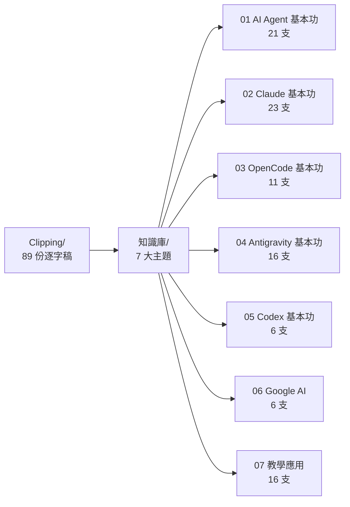

# 📇 知識庫總索引（Index）

> 本索引由 Agent 於知識庫重整時自動建立。資料來源：`Clipping/`（@sensebar 頻道逐字稿）。
> 點主題名稱可進入各主題總覽。

---

## 主題一覽

| 主題 | 影片數 | 一句話 | 總覽 |
|------|--------|--------|------|
| [[01_AI_Agent_基本功/主題總覽\|01 AI Agent 基本功]] | 21 | AI Agent 讓 AI「長出手腳」住進你的電腦，能讀檔、寫程式、上網、出成品；老師學會後備課、出考卷、做教材全面自動化。 | [[01_AI_Agent_基本功/主題總覽]] |
| [[02_Claude_基本功/主題總覽\|02 Claude 基本功]] | 23 | 把 Claude 當成數位助教：從聊天、Skills、串接 NotebookLM／Obsidian／GitHub，到打造教學駕駛艙，不懂程式也能用。 | [[02_Claude_基本功/主題總覽]] |
| [[03_OpenCode_基本功/主題總覽\|03 OpenCode 基本功]] | 11 | 用開源、免費或便宜的 AI Agent，不必月付 20 美金也能自動備課、整理檔案、做簡報。 | [[03_OpenCode_基本功/主題總覽]] |
| [[04_Antigravity_基本功/主題總覽\|04 Antigravity 基本功]] | 16 | 用 Google AntiGravity 2 把備課、出題、批改、收作業自動化，一套流程打通 Obsidian 第二大腦。 | [[04_Antigravity_基本功/主題總覽]] |
| [[05_Codex_基本功/主題總覽\|05 Codex 基本功]] | 6 | GPT Codex 便宜好上手，手把手從安裝、設定、接 GitHub／Obsidian、串資料庫到「開工／收工」工作模式。 | [[05_Codex_基本功/主題總覽]] |
| [[06_Google_AI/主題總覽\|06 Google AI]] | 6 | 從設定、Deep Research、生圖、Gem、Canvas 到 Notebook LM，把 Google 免費 AI 用在教學上。 | [[06_Google_AI/主題總覽]] |
| [[07_教學應用/主題總覽\|07 教學應用]] | 16 | 把做簡報、出考卷、剪影片、寫課程計畫、批作文全部自動化，把心力留給學生。 | [[07_教學應用/主題總覽]] |

> 💡 影片支數為「逐字稿檔案數」，因同系列含「有字幕完整版」與「無字幕版」等不同版本，故總數會略高於 89。

---

## 📊 各主題下載品質摘要

| 主題 | 有字幕 | 無字幕 |
|------|--------|--------|
| 01 AI Agent 基本功 | 11 | 10 |
| 02 Claude 基本功 | 21 | 2 |
| 03 OpenCode 基本功 | 5 | 6 |
| 04 Antigravity 基本功 | 8 | 8 |
| 05 Codex 基本功 | 5 | 1 |
| 06 Google AI | 6 | 0 |
| 07 教學應用 | 12 | 4 |

> 無字幕影片多為直播重錄版或較新影片，可之後再補抓，或直接看影片。

---

## 🔄 每周重整 SOP（Agent 用）

1. 掃描 `Clipping/` 找新增逐字稿。
2. 新增檔依主題歸入上述 7 大類（或開新主題）。
3. 更新對應主題的 `主題總覽.md`（補影片列＋摘要）。
4. 更新本索引統計數字。
5. 在 `日誌.md` 記錄本次重整日期與變更。
